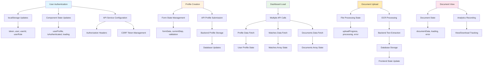

# Complete End-to-End Data Flow: Registration to OCR Processing

## Master Flow Diagram - Complete User Journey

```mermaid
graph TD
    subgraph "User Entry & Authentication"
        A[User Visits App] --> B{Authenticated?}
        B -->|No| C[Landing Page]
        B -->|Yes| D{Profile Complete?}
        
        C --> E[Auth Page]
        E --> F[SignIn/SignUp Components]
        F --> G{Auth Method?}
        
        G -->|OAuth| H[Google/LinkedIn OAuth]
        G -->|Manual| I[Email/Password Form]
        
        H --> J[OAuthCallback.tsx]
        J --> K{Role Selected?}
        K -->|No| L[RoleSelector.tsx]
        K -->|Yes| M[Store Auth Data]
        
        I --> N[authService.register/login]
        N --> O[API: POST /auth/register or /auth/login]
        O --> M
        
        L --> P[authService.updateRole]
        P --> Q[API: POST /auth/update-role]
        Q --> M
        
        M --> R[localStorage: token, user, userId, userRole]
        R --> S[Navigate to Profile Check]
    end
    
    subgraph "Profile Creation Flow"
        D -->|No| T[VentureMatch Form]
        S --> T
        
        T --> U[UserTypeSelection]
        U --> V{User Type?}
        
        V -->|startup| W[Startup Form Flow]
        V -->|investor| X[Investor Form Flow]
        
        W --> W1[Company Name Input]
        W1 --> W2[Industry Selection]
        W2 --> W3[Funding Stage Selection]
        W3 --> W4[Employee Count Input]
        W4 --> W5[Location Input]
        W5 --> W6[Pitch Description]
        
        X --> X1[Company Name Input]
        X1 --> X2[Industries of Interest]
        X2 --> X3[Preferred Stages]
        X3 --> X4[Ticket Size Selection]
        X4 --> X5[Investment Criteria]
        X5 --> X6[Past Investments]
        
        W6 --> Y[Form Validation]
        X6 --> Y
        
        Y --> Z{Valid?}
        Z -->|No| AA[Show Validation Errors]
        Z -->|Yes| BB[submitProfile]
        
        BB --> CC{User Type?}
        CC -->|startup| DD[API: POST /profile/startup]
        CC -->|investor| EE[API: POST /profile/investor]
        
        DD --> FF[Navigate to Dashboard]
        EE --> FF
    end
    
    subgraph "Dashboard & Core Functions"
        D -->|Yes| FF
        
        FF --> GG[Dashboard.tsx]
        GG --> HH[Load User Profile]
        HH --> II[API: GET /profile/user-type]
        
        GG --> JJ[Fetch Matches]
        JJ --> KK{User Role?}
        KK -->|startup| LL[searchInvestors]
        KK -->|investor| MM[searchStartups]
        
        LL --> NN[API: GET /search/investors]
        MM --> OO[API: GET /search/startups]
        
        NN --> PP[Display Investor Matches]
        OO --> QQ[Display Startup Matches]
        
        PP --> RR[MatchesList Component]
        QQ --> RR
        
        RR --> SS[Match Selection]
        SS --> TT[fetchCompatibilityData]
        TT --> UU[API: GET /score/compatibility/{startup}/{investor}]
        UU --> VV[CompatibilitySection Display]
        
        SS --> WW[Recommendation Service]
        WW --> XX[API: GET /recommendations/match/{startup}/{investor}]
        XX --> YY[AI Recommendations Display]
    end
    
    subgraph "Document Management System"
        GG --> ZZ[Documents Tab]
        ZZ --> AAA[DocumentsSection.tsx]
        
        AAA --> BBB[Document Upload Interface]
        BBB --> CCC[File Selection]
        CCC --> DDD[Metadata Input]
        DDD --> EEE[profileService.uploadDocument]
        
        EEE --> FFF[Create FormData]
        FFF --> GGG[Append File + Metadata]
        GGG --> HHH[API: POST /profile/documents/upload]
        
        HHH --> III[Backend: Multer File Processing]
        III --> JJJ[File Storage System]
        JJJ --> KKK[OCR Service Trigger]
        
        KKK --> LLL{File Type Detection}
        LLL -->|PDF| MMM[PDF OCR Processing]
        LLL -->|Image| NNN[Image OCR Processing]
        LLL -->|Excel/Word| OOO[Document OCR Processing]
        LLL -->|Other| PPP[Skip OCR]
        
        MMM --> QQQ[Extract Text from PDF Pages]
        NNN --> RRR[Extract Text from Image]
        OOO --> SSS[Extract Text from Document]
        
        QQQ --> TTT[OCR Text Results]
        RRR --> TTT
        SSS --> TTT
        PPP --> UUU[Metadata Only]
        
        TTT --> VVV[Store OCR Results in Database]
        UUU --> WWW[Store File Metadata]
        
        VVV --> XXX[Database: documents table]
        WWW --> XXX
        
        XXX --> YYY[Return Document Record]
        YYY --> ZZZ[Frontend: Update Document List]
        ZZZ --> AAAA[useEntityDocuments Hook Refresh]
    end
    
    subgraph "Document Viewing & Analytics"
        AAAA --> BBBB[Document List Display]
        BBBB --> CCCC[Document Item Click]
        CCCC --> DDDD[Navigate to DocumentViewerPage]
        
        DDDD --> EEEE[useDocumentViewer Hook]
        EEEE --> FFFF[API: GET /profile/documents/{documentId}]
        FFFF --> GGGG[Document Data Retrieved]
        
        GGGG --> HHHH[Record View Analytics]
        HHHH --> IIII[API: POST /analytics/document-view]
        
        GGGG --> JJJJ{File Type?}
        JJJJ -->|PDF| KKKK[PDF Viewer Component]
        JJJJ -->|Image| LLLL[Image Display]
        JJJJ -->|Other| MMMM[Download Link]
        
        DDDD --> NNNN[Download Button Click]
        NNNN --> OOOO[profileService.downloadDocument]
        OOOO --> PPPP[API: GET /profile/documents/{id}/download]
        PPPP --> QQQQ[Record Download Analytics]
        QQQQ --> RRRR[API: POST /analytics/document-download]
    end
    
    subgraph "Financial Due Diligence Flow"
        GG --> SSSS[Analytics Tab]
        SSSS --> TTTT[Financial Due Diligence Section]
        
        TTTT --> UUUU[Upload Financial Documents]
        UUUU --> VVVV[profileService.uploadFinancialDocuments]
        VVVV --> WWWW[API: POST /financial/upload]
        
        WWWW --> XXXX[Backend: Financial Document Processing]
        XXXX --> YYYY[OCR for Financial Data Extraction]
        YYYY --> ZZZZ[Extract Key Financial Metrics]
        
        ZZZZ --> AAAAA[Store Financial Data]
        AAAAA --> BBBBB[Generate Financial Report]
        BBBBB --> CCCCC[API: POST /financial/generate]
        
        TTTT --> DDDDD[View Financial Reports]
        DDDDD --> EEEEE[financialDueDiligenceService.getReport]
        EEEEE --> FFFFF[API: GET /financial/match/{startup}/{investor}]
        FFFFF --> GGGGG[Financial Analysis Display]
        
        GGGGG --> HHHHH[Export to PDF]
        HHHHH --> IIIII[API: GET /financial/match/{startup}/{investor}/pdf]
        
        GGGGG --> JJJJJ[Share Report]
        JJJJJ --> KKKKK[API: POST /financial/match/{startup}/{investor}/share]
    end
    
    subgraph "Profile Sharing & Communication"
        GG --> LLLLL[Profile Sharing]
        LLLLL --> MMMMM[profileService.shareProfileViaEmail]
        MMMMM --> NNNNN[Get Current Profile Data]
        NNNNN --> OOOOO[Generate Direct Profile URL]
        OOOOO --> PPPPP[API: POST /profile/share/email]
        
        AAAA --> QQQQQ[Document Request]
        QQQQQ --> RRRRR[Show Request Modal]
        RRRRR --> SSSSS[messagesService.send]
        SSSSS --> TTTTT[API: POST /messages/send]
        TTTTT --> UUUUU[Backend: Store & Send Message]
    end
    
    style A fill:#e1f5fe
    style T fill:#fff3e0
    style GG fill:#e8f5e8
    style BBB fill:#ffecb3
    style KKK fill:#fce4ec
    style TTT fill:#f3e5f5
    style TTTT fill:#fff8e1
```

## Detailed Function Call Hierarchy

### 1. Authentication Function Chain

```mermaid
graph LR
    A[User Action] --> B[Component Event]
    B --> C[Auth Service Function]
    C --> D[API Service Call]
    D --> E[Backend Endpoint]
    
    subgraph "Register Flow"
        F[SignUp.handleSubmit] --> G[authService.register]
        G --> H[api.post('/auth/register')]
        H --> I[Backend: User Creation]
        I --> J[JWT Token Generation]
        J --> K[Response to Frontend]
        K --> L[localStorage Storage]
        L --> M[Navigation to Profile]
    end
    
    subgraph "Login Flow"
        N[SignIn.handleSubmit] --> O[authService.login]
        O --> P[api.post('/auth/login')]
        P --> Q[Backend: Credential Validation]
        Q --> R[JWT Token Generation]
        R --> S[Response to Frontend]
        S --> T[localStorage Storage]
        T --> U[Navigation to Dashboard]
    end
    
    subgraph "OAuth Flow"
        V[OAuth Button Click] --> W[window.location redirect]
        W --> X[OAuth Provider Authentication]
        X --> Y[OAuth Callback URL]
        Y --> Z[OAuthCallback Component]
        Z --> AA[Token Processing]
        AA --> BB[Role Selection if Needed]
        BB --> CC[authService.updateRole]
        CC --> DD[api.post('/auth/update-role')]
        DD --> EE[Navigation to Dashboard]
    end
```

### 2. Document Upload Function Chain

```mermaid
graph LR
    A[File Selection] --> B[Metadata Input]
    B --> C[Upload Button Click]
    C --> D[profileService.uploadDocument]
    D --> E[FormData Creation]
    E --> F[File Validation]
    F --> G[API Call with FormData]
    G --> H[Backend Multer Processing]
    H --> I[File Storage]
    I --> J[OCR Service Invocation]
    J --> K[OCR Processing]
    K --> L[Results Storage]
    L --> M[Database Record Creation]
    M --> N[Response to Frontend]
    N --> O[UI Update]
    
    subgraph "OCR Processing Detail"
        K --> K1{File Type?}
        K1 -->|PDF| K2[PDF Text Extraction]
        K1 -->|Image| K3[Image OCR Processing]
        K1 -->|Document| K4[Document Text Extraction]
        
        K2 --> K5[Extract Text by Page]
        K3 --> K6[Extract Text from Image]
        K4 --> K7[Extract Structured Data]
        
        K5 --> L
        K6 --> L
        K7 --> L
    end
```



### 3. Search and Matching Function Chain

```mermaid
graph LR
    A[Search Input] --> B[Debounced Search]
    B --> C[Filter Application]
    C --> D[Search Service Call]
    D --> E{User Type?}
    E -->|startup| F[searchInvestors]
    E -->|investor| G[searchStartups]
    
    F --> H[api.get('/search/investors')]
    G --> I[api.get('/search/startups')]
    
    H --> J[Process Investor Results]
    I --> K[Process Startup Results]
    
    J --> L[Update Matches State]
    K --> L
    
    L --> M[Render MatchesList]
    M --> N[Match Item Click]
    N --> O[fetchCompatibilityData]
    O --> P[api.get('/score/compatibility/{startup}/{investor}')]
    P --> Q[Update Compatibility State]
    Q --> R[Render CompatibilitySection]
    
    N --> S[Recommendation Trigger]
    S --> T[recommendationService.getMatchRecommendations]
    T --> U[api.get('/recommendations/match/{startup}/{investor}')]
    U --> V[Update Recommendations State]
    V --> W[Render Recommendations]
```

### 4. Complete Data State Flow



## API Endpoint Mapping

### Authentication Endpoints
- `POST /auth/register` - User registration
- `POST /auth/login` - User login
- `POST /auth/update-role` - Update user role
- `GET /csrf-token` - Get CSRF token

### Profile Endpoints
- `GET /profile/user-type` - Get user profile type
- `GET /profile/check-profile` - Check profile completion
- `POST /profile/startup` - Create/update startup profile
- `POST /profile/investor` - Create/update investor profile
- `GET /profile/startup` - Get startup profile
- `GET /profile/investor` - Get investor profile

### Document Endpoints
- `POST /profile/documents/upload` - Upload document
- `GET /profile/documents` - Get user documents
- `GET /profile/documents/{id}` - Get specific document
- `GET /profile/documents/{id}/download` - Download document
- `PUT /profile/documents/{id}` - Update document metadata
- `DELETE /profile/documents/{id}` - Delete document

### Search Endpoints
- `GET /search/startups` - Search startups
- `GET /search/investors` - Search investors
- `GET /search/options` - Get filter options

### Analytics Endpoints
- `GET /score/compatibility/{startup}/{investor}` - Get compatibility score
- `GET /recommendations/match/{startup}/{investor}` - Get recommendations
- `POST /analytics/document-view` - Record document view
- `POST /analytics/document-download` - Record document download

### Financial Due Diligence Endpoints
- `POST /financial/upload` - Upload financial documents
- `POST /financial/generate` - Generate financial report
- `GET /financial/match/{startup}/{investor}` - Get financial analysis
- `GET /financial/entity/{entityId}` - Get entity financial report
- `GET /financial/match/{startup}/{investor}/pdf` - Export report as PDF
- `POST /financial/match/{startup}/{investor}/share` - Share report

This comprehensive mapping shows how every user action flows through the frontend components, services, and API endpoints to create a complete venture matching and document analysis platform.
