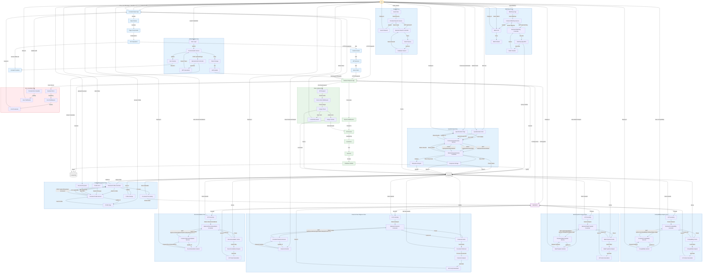

```mermaid
flowchart TB
    %% Main Components
    User([User])
    FrontendApp[Frontend React App]
    BackendApp[Backend Express App]
    PostgreSQL[(PostgreSQL)]
    MongoDB[(MongoDB)]
    GeminiAI[Gemini AI]
    
    %% Frontend Components
    ReactRouter[React Router]
    FrontendPages[Page Components]
    UIComponents[UI Components]
    CustomHooks[Custom Hooks]
    ContextProviders[Context Providers]
    APIServices[API Services]
    AxiosClient[Axios Client]
    
    %% Backend Components
    ExpressMiddleware[Express Middleware]
    APIRoutes[API Routes]
    Controllers[Controllers]
    Services[Services]
    Models[Database Models]
    
    %% Main Flow
    User -->|Interacts with| FrontendApp
    FrontendApp -->|HTTP Requests| BackendApp
    BackendApp -->|Queries| PostgreSQL
    BackendApp -->|Queries| MongoDB
    BackendApp -->|AI Requests| GeminiAI
    GeminiAI -->|AI Responses| BackendApp
    BackendApp -->|HTTP Responses| FrontendApp
    FrontendApp -->|Renders UI| User
    
    %% Frontend Internal Flow
    FrontendApp -->|Routes| ReactRouter
    ReactRouter -->|Renders| FrontendPages
    FrontendPages -->|Composed of| UIComponents
    UIComponents -->|Use| CustomHooks
    UIComponents -->|Access State via| ContextProviders
    CustomHooks -->|Call| APIServices
    APIServices -->|Use| AxiosClient
    AxiosClient -->|HTTP Requests| BackendApp
    
    %% Backend Internal Flow
    BackendApp -->|Processes| ExpressMiddleware
    ExpressMiddleware -->|Routes to| APIRoutes
    APIRoutes -->|Handled by| Controllers
    Controllers -->|Use| Services
    Services -->|Access| Models
    Models -->|Query| PostgreSQL
    Models -->|Query| MongoDB
    
    %% Authentication Flow
    subgraph AuthenticationFlow [Authentication Flow]
        UserLogin[User Login]
        FrontendAuth[Frontend Auth Service]
        BackendAuth[Backend Auth Controller]
        JWTGeneration[JWT Generation]
        TokenStorage[Token Storage]
        AuthHeader[Auth Header]
        UserSession[User Session]
    end
    
    User -->|Login Credentials| UserLogin
    UserLogin -->|Submit| FrontendAuth
    FrontendAuth -->|POST /api/auth/login| BackendAuth
    BackendAuth -->|Verify Credentials| PostgreSQL
    BackendAuth -->|Generate| JWTGeneration
    JWTGeneration -->|Return Token| FrontendAuth
    FrontendAuth -->|Store| TokenStorage
    TokenStorage -->|Set| AuthHeader
    AuthHeader -->|Subsequent Requests| BackendApp
    FrontendAuth -->|Update| UserSession
    UserSession -->|Stored in| ContextProviders
    
    %% Profile Management Flow
    subgraph ProfileFlow [Profile Management Flow]
        ProfilePage[Profile Page]
        ProfileForm[Profile Form]
        FrontendProfile[Frontend Profile Service]
        BackendProfile[Backend Profile Controller]
        ProfileStorage[Profile Storage]
        DocumentUpload[Document Upload]
        DocumentProcessing[Document Processing]
    end
    
    User -->|Access Profile| ProfilePage
    ProfilePage -->|Fetch Profile| FrontendProfile
    FrontendProfile -->|GET /api/profile| BackendProfile
    BackendProfile -->|Retrieve| MongoDB
    MongoDB -->|Return Data| BackendProfile
    BackendProfile -->|Return Profile| FrontendProfile
    FrontendProfile -->|Update UI| ProfilePage
    
    User -->|Edit Profile| ProfileForm
    ProfileForm -->|Submit Changes| FrontendProfile
    FrontendProfile -->|PUT /api/profile| BackendProfile
    BackendProfile -->|Update| ProfileStorage
    ProfileStorage -->|Save to| MongoDB
    
    User -->|Upload Document| DocumentUpload
    DocumentUpload -->|Send File| FrontendProfile
    FrontendProfile -->|POST /api/profile/upload-document| BackendProfile
    BackendProfile -->|Process| DocumentProcessing
    DocumentProcessing -->|Extract Data| GeminiAI
    DocumentProcessing -->|Store Metadata| MongoDB
    
    %% Matching Flow
    subgraph MatchingFlow [Matching Flow]
        MatchingPage[Matching Page]
        MatchList[Match List]
        MatchDetails[Match Details]
        FrontendMatching[Frontend Matching Service]
        BackendMatching[Backend Matching Controller]
        MatchingAlgorithm[Matching Algorithm]
        MatchResults[Match Results]
    end
    
    User -->|View Matches| MatchingPage
    MatchingPage -->|Fetch Matches| FrontendMatching
    FrontendMatching -->|GET /api/matching| BackendMatching
    BackendMatching -->|Execute| MatchingAlgorithm
    MatchingAlgorithm -->|Query Profiles| MongoDB
    MatchingAlgorithm -->|Generate| MatchResults
    MatchResults -->|Return| BackendMatching
    BackendMatching -->|Return Matches| FrontendMatching
    FrontendMatching -->|Update| MatchList
    MatchList -->|Display to| User
    
    User -->|Select Match| MatchList
    MatchList -->|Show| MatchDetails
    
    %% Compatibility Analysis Flow
    subgraph CompatibilityFlow [Compatibility Analysis Flow]
        CompatibilitySection[Compatibility Section]
        FrontendCompatibility[Frontend Compatibility Service]
        BackendCompatibility[Backend Compatibility Controller]
        CompatibilityCache[Compatibility Cache]
        CompatibilityAnalysis[Compatibility Analysis]
        AIPromptGeneration[AI Prompt Generation]
        AIProcessing[AI Processing]
    end
    
    User -->|View Compatibility| CompatibilitySection
    CompatibilitySection -->|Request Analysis| FrontendCompatibility
    FrontendCompatibility -->|GET /api/score/compatibility/:startupId/:investorId| BackendCompatibility
    BackendCompatibility -->|Check| CompatibilityCache
    CompatibilityCache -->|Query| MongoDB
    
    CompatibilityCache -->|Cache Miss| CompatibilityAnalysis
    CompatibilityAnalysis -->|Generate| AIPromptGeneration
    AIPromptGeneration -->|Send to| GeminiAI
    GeminiAI -->|Process| AIProcessing
    AIProcessing -->|Store Results| MongoDB
    AIProcessing -->|Return Analysis| BackendCompatibility
    
    CompatibilityCache -->|Cache Hit| BackendCompatibility
    BackendCompatibility -->|Return Data| FrontendCompatibility
    FrontendCompatibility -->|Update UI| CompatibilitySection
    CompatibilitySection -->|Display to| User
    
    %% Belief System Analysis Flow
    subgraph BeliefSystemFlow [Belief System Analysis Flow]
        BeliefSystemSection[Belief System Section]
        FrontendBeliefSystem[Frontend Belief System Service]
        BackendBeliefSystem[Backend Belief System Controller]
        BeliefSystemCache[Belief System Cache]
        BeliefSystemAnalysis[Belief System Analysis]
        BeliefAIPrompt[AI Prompt Generation]
        BeliefAIProcessing[AI Processing]
    end
    
    User -->|View Belief Analysis| BeliefSystemSection
    BeliefSystemSection -->|Request Analysis| FrontendBeliefSystem
    FrontendBeliefSystem -->|GET /api/analysis/belief-system/:startupId/:investorId| BackendBeliefSystem
    BackendBeliefSystem -->|Check| BeliefSystemCache
    BeliefSystemCache -->|Query| MongoDB
    
    BeliefSystemCache -->|Cache Miss| BeliefSystemAnalysis
    BeliefSystemAnalysis -->|Generate| BeliefAIPrompt
    BeliefAIPrompt -->|Send to| GeminiAI
    GeminiAI -->|Process| BeliefAIProcessing
    BeliefAIProcessing -->|Store Results| MongoDB
    BeliefAIProcessing -->|Return Analysis| BackendBeliefSystem
    
    BeliefSystemCache -->|Cache Hit| BackendBeliefSystem
    BackendBeliefSystem -->|Return Data| FrontendBeliefSystem
    FrontendBeliefSystem -->|Update UI| BeliefSystemSection
    BeliefSystemSection -->|Display to| User
    
    %% Financial Due Diligence Flow
    subgraph FinancialFlow [Financial Due Diligence Flow]
        FinancialSection[Financial Section]
        FrontendFinancial[Frontend Financial Service]
        BackendFinancial[Backend Financial Controller]
        FinancialCache[Financial Cache]
        DocumentRetrieval[Document Retrieval]
        FinancialAnalysis[Financial Analysis]
        FinancialAIPrompt[AI Prompt Generation]
        FinancialAIProcessing[AI Processing]
    end
    
    User -->|View Financial Analysis| FinancialSection
    FinancialSection -->|Request Analysis| FrontendFinancial
    FrontendFinancial -->|GET /api/financial/match/generate/:startupId/:investorId| BackendFinancial
    BackendFinancial -->|Check| FinancialCache
    FinancialCache -->|Query| MongoDB
    
    FinancialCache -->|Cache Miss| DocumentRetrieval
    DocumentRetrieval -->|Get Documents| MongoDB
    DocumentRetrieval -->|Process Documents| FinancialAnalysis
    FinancialAnalysis -->|Generate| FinancialAIPrompt
    FinancialAIPrompt -->|Send to| GeminiAI
    GeminiAI -->|Process| FinancialAIProcessing
    FinancialAIProcessing -->|Store Results| MongoDB
    FinancialAIProcessing -->|Return Analysis| BackendFinancial
    
    FinancialCache -->|Cache Hit| BackendFinancial
    BackendFinancial -->|Return Data| FrontendFinancial
    FrontendFinancial -->|Update UI| FinancialSection
    FinancialSection -->|Display to| User
    
    %% Recommendation Flow
    subgraph RecommendationFlow [Recommendation Flow]
        RecommendationSection[Recommendation Section]
        FrontendRecommendation[Frontend Recommendation Service]
        BackendRecommendation[Backend Recommendation Controller]
        RecommendationCache[Recommendation Cache]
        RecommendationAnalysis[Recommendation Analysis]
        RecommendationAIPrompt[AI Prompt Generation]
        RecommendationAIProcessing[AI Processing]
    end
    
    User -->|View Recommendations| RecommendationSection
    RecommendationSection -->|Request Recommendations| FrontendRecommendation
    FrontendRecommendation -->|GET /api/recommendations/match/:startupId/:investorId| BackendRecommendation
    BackendRecommendation -->|Check| RecommendationCache
    RecommendationCache -->|Query| MongoDB
    
    RecommendationCache -->|Cache Miss| RecommendationAnalysis
    RecommendationAnalysis -->|Generate| RecommendationAIPrompt
    RecommendationAIPrompt -->|Send to| GeminiAI
    GeminiAI -->|Process| RecommendationAIProcessing
    RecommendationAIProcessing -->|Store Results| MongoDB
    RecommendationAIProcessing -->|Return Recommendations| BackendRecommendation
    
    RecommendationCache -->|Cache Hit| BackendRecommendation
    BackendRecommendation -->|Return Data| FrontendRecommendation
    FrontendRecommendation -->|Update UI| RecommendationSection
    RecommendationSection -->|Display to| User
    
    %% Questionnaire Flow
    subgraph QuestionnaireFlow [Questionnaire Flow]
        QuestionnairePage[Questionnaire Page]
        QuestionnaireForm[Questionnaire Form]
        FrontendQuestionnaire[Frontend Questionnaire Service]
        BackendQuestionnaire[Backend Questionnaire Controller]
        ResponseStorage[Response Storage]
        ResponseAnalysis[Response Analysis]
    end
    
    User -->|Access Questionnaire| QuestionnairePage
    QuestionnairePage -->|Fetch Status| FrontendQuestionnaire
    FrontendQuestionnaire -->|GET /api/questionnaire/status| BackendQuestionnaire
    BackendQuestionnaire -->|Check Status| MongoDB
    BackendQuestionnaire -->|Return Status| FrontendQuestionnaire
    FrontendQuestionnaire -->|Update UI| QuestionnairePage
    
    User -->|Fill Form| QuestionnaireForm
    QuestionnaireForm -->|Save Draft| FrontendQuestionnaire
    FrontendQuestionnaire -->|POST /api/questionnaire/draft| BackendQuestionnaire
    BackendQuestionnaire -->|Store Draft| ResponseStorage
    ResponseStorage -->|Save to| MongoDB
    
    User -->|Submit Form| QuestionnaireForm
    QuestionnaireForm -->|Submit Responses| FrontendQuestionnaire
    FrontendQuestionnaire -->|POST /api/questionnaire/submit| BackendQuestionnaire
    BackendQuestionnaire -->|Store Responses| ResponseStorage
    ResponseStorage -->|Save to| MongoDB
    BackendQuestionnaire -->|Analyze| ResponseAnalysis
    ResponseAnalysis -->|Update| MongoDB
    BackendQuestionnaire -->|Return Results| FrontendQuestionnaire
    FrontendQuestionnaire -->|Show Results| QuestionnairePage
    QuestionnairePage -->|Display to| User
    
    %% Search Flow
    subgraph SearchFlow [Search Flow]
        SearchBar[Search Bar]
        SearchResults[Search Results]
        FrontendSearch[Frontend Search Service]
        BackendSearch[Backend Search Controller]
        SearchQuery[Search Query]
        DatabaseSearch[Database Search]
    end
    
    User -->|Enter Search| SearchBar
    SearchBar -->|Submit Query| FrontendSearch
    FrontendSearch -->|GET /api/search| BackendSearch
    BackendSearch -->|Parse| SearchQuery
    SearchQuery -->|Execute| DatabaseSearch
    DatabaseSearch -->|Query| MongoDB
    DatabaseSearch -->|Return Results| BackendSearch
    BackendSearch -->|Return Data| FrontendSearch
    FrontendSearch -->|Update| SearchResults
    SearchResults -->|Display to| User
    
    %% Rate Limiting Flow
    subgraph RateLimitingFlow [Rate Limiting Flow]
        APIRequest[API Request]
        RateLimiter[Rate Limiter Middleware]
        UsageCheck[Usage Check]
        UsageCounter[Usage Counter]
        LimitEnforcement[Limit Enforcement]
    end
    
    BackendApp -->|Incoming Request| APIRequest
    APIRequest -->|Check Limits| RateLimiter
    RateLimiter -->|Check Usage| UsageCheck
    UsageCheck -->|Query| MongoDB
    UsageCheck -->|Under Limit| UsageCounter
    UsageCounter -->|Increment| MongoDB
    UsageCounter -->|Allow Request| APIRoutes
    
    UsageCheck -->|Over Limit| LimitEnforcement
    LimitEnforcement -->|Return Error| FrontendApp
    FrontendApp -->|Show Limit Message| User
    
    %% Error Handling Flow
    subgraph ErrorHandlingFlow [Error Handling Flow]
        BackendError[Backend Error]
        ErrorMiddleware[Error Middleware]
        ErrorResponse[Error Response]
        FrontendErrorHandler[Frontend Error Handler]
        UserNotification[User Notification]
    end
    
    BackendApp -->|Error Occurs| BackendError
    BackendError -->|Caught by| ErrorMiddleware
    ErrorMiddleware -->|Format| ErrorResponse
    ErrorResponse -->|Return to| FrontendApp
    FrontendApp -->|Handle with| FrontendErrorHandler
    FrontendErrorHandler -->|Display| UserNotification
    UserNotification -->|Show to| User
    
    %% Styling
    classDef frontend fill:#e3f2fd,stroke:#1565c0,stroke-width:1px;
    classDef backend fill:#e8f5e9,stroke:#388e3c,stroke-width:1px;
    classDef database fill:#f5f5f5,stroke:#333,stroke-width:1px;
    classDef ai fill:#f3e5f5,stroke:#7b1fa2,stroke-width:1px;
    classDef user fill:#fff8e1,stroke:#ffa000,stroke-width:1px;
    
    class User user;
    class FrontendApp,ReactRouter,FrontendPages,UIComponents,CustomHooks,ContextProviders,APIServices,AxiosClient frontend;
    class BackendApp,ExpressMiddleware,APIRoutes,Controllers,Services,Models backend;
    class PostgreSQL,MongoDB database;
    class GeminiAI ai;
    
    %% Subgraph Styling
    style AuthenticationFlow fill:#e3f2fd,stroke:#1565c0,stroke-width:1px;
    style ProfileFlow fill:#e3f2fd,stroke:#1565c0,stroke-width:1px;
    style MatchingFlow fill:#e3f2fd,stroke:#1565c0,stroke-width:1px;
    style CompatibilityFlow fill:#e3f2fd,stroke:#1565c0,stroke-width:1px;
    style BeliefSystemFlow fill:#e3f2fd,stroke:#1565c0,stroke-width:1px;
    style FinancialFlow fill:#e3f2fd,stroke:#1565c0,stroke-width:1px;
    style RecommendationFlow fill:#e3f2fd,stroke:#1565c0,stroke-width:1px;
    style QuestionnaireFlow fill:#e3f2fd,stroke:#1565c0,stroke-width:1px;
    style SearchFlow fill:#e3f2fd,stroke:#1565c0,stroke-width:1px;
    style RateLimitingFlow fill:#e8f5e9,stroke:#388e3c,stroke-width:1px;
    style ErrorHandlingFlow fill:#ffebee,stroke:#c62828,stroke-width:1px;
```
