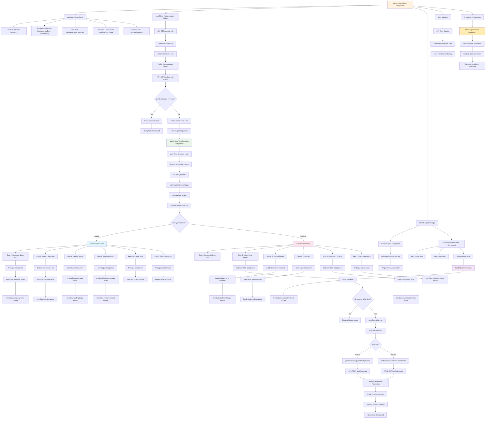

# Ultra-Comprehensive Frontend Data Flow and Function Call Diagrams

## 📋 Complete File Inventory - All 181 Files Analyzed

### Core Application Files
- **main.tsx** - Application entry point with React 18 createRoot and TutorialProvider
- **App.tsx** - Main routing and authentication logic with protected routes (7 route components)
- **index.css** & **App.css** - Global styling and theming with CSS variables
- **vite-env.d.ts** - Vite environment type definitions

### Landing Page Components
- **Landing.tsx** - Main landing page container with SEO integration
- **Navigation.tsx** - Header navigation with auth state management and active section tracking
- **HeroSection.tsx** - Hero section with role-based CTA buttons and Framer Motion animations
- **FeatureSection.tsx** - Interactive 3D flip cards with detailed features and scroll animations
- **WorkingSection.tsx** - Step-by-step process explanation with expandable sections
- **CTAsection.tsx** - Call-to-action with email signup and newsletter integration
- **Footer.tsx** - Footer with social links, newsletter, and legal page links

### Authentication Components
- **Auth.tsx** - Authentication page wrapper with login/signup toggle
- **SignIn.tsx** & **SignUp.tsx** - Form components with comprehensive validation
- **OAuthCallback.tsx** - OAuth callback handler for Google/LinkedIn with role selection
- **RoleSelector.tsx** - Role selection component for OAuth users with API integration
- **AuthErrorDisplay.tsx** - Error display component with retry functionality
- **Logo.tsx** - Brand logo component with configurable sizing

### Dashboard Architecture
- **Dashboard.tsx** - Main dashboard container (637 lines) with tab management and user profile handling
- **DashboardLayout/index.tsx** - Layout wrapper with sidebar and responsive design
- **DashboardSidebar.tsx** - Navigation sidebar with role-based styling and active state management
- **DashboardHeader.tsx** - Top header with user controls, notifications, and breadcrumbs
- **BackgroundPattern.tsx** - Role-based background patterns with SVG animations
- **DropdownPortal.tsx** - Portal component for dropdown menus outside layout constraints
- **AppHeader.tsx** - Alternative header component for different page layouts

### Dashboard Sections
- **Overview/OverviewSection.tsx** - Dashboard overview with analytics widgets
- **Overview/StatCard.tsx** - Statistics display cards with animations and data formatting
- **Overview/RecentMatches.tsx** - Recent matches widget with pagination and filtering
- **Overview/ActivityTimeline.tsx** - Activity feed component with real-time updates
- **Overview/UpcomingTasks.tsx** - Task management widget with completion tracking
- **Overview/TaskManager.tsx** - Advanced task management with AI task generation
- **Overview/InsightsPanel.tsx** - AI insights display with recommendation engine
- **Overview/EngagementChart.tsx** - Engagement analytics charts with multiple data series

### Matching System
- **Matches/MatchesSection.tsx** - Main matches container with search and filtering
- **Matches/MatchCard.tsx** - Individual match cards with compatibility scores
- **Matches/MatchDetails.tsx** - Detailed match view with comprehensive profile data
- **Matches/MatchFilters.tsx** - Advanced filtering system with dynamic filter options
- **MatchList/SortControls.tsx** - Sorting functionality with multiple sort criteria
- **CompatibilitySection/index.tsx** - Compatibility analysis display with breakdown charts
- **MatchesList/index.tsx** - Match list container with pagination and view mode controls

### Matching System
- **Matches/MatchesSection.tsx** - Main matches container with search and filtering
- **Matches/MatchCard.tsx** - Individual match cards with compatibility scores
- **Matches/MatchDetails.tsx** - Detailed match view with comprehensive profile data
- **Matches/MatchFilters.tsx** - Advanced filtering system with dynamic filter options
- **MatchList/SortControls.tsx** - Sorting functionality with multiple sort criteria
- **CompatibilitySection/index.tsx** - Compatibility analysis display with breakdown charts
- **MatchesList/index.tsx** - Match list container with pagination and view mode controls

### Match Pages Components (Advanced Matching Features)
- **MatchesPage/Header.tsx** - Matches page header with breadcrumbs and action buttons
- **MatchesPage/UserTypeSelection.tsx** - User type selector with role-based preferences
- **MatchesPage/FormProgress.tsx** - Form progress indicator with step visualization
- **MatchesPage/FormNavigationFooter.tsx** - Navigation controls with validation logic
- **MatchesPage/AnimatingTransition.tsx** - Page transition animations with smooth effects
- **MatchesPage/CompatibilityBreakdown.tsx** - Detailed compatibility analysis with charts
- **MatchesPage/AIRecomendations.tsx** - AI-powered recommendations with confidence scores
- **MatchesPage/Pagination.tsx** - Pagination controls with dynamic page sizing
- **MatchesPage/ResultsCounter.tsx** - Results counter display with filtering information
- **MatchesPage/MatchCards/renderMarchCards.tsx** - Match card renderer with optimization

### Analytics Components (Comprehensive Reporting)
- **Analytics/AnalyticsSection.tsx** - Analytics dashboard container with tab management
- **Analytics/BeliefSystemAnalytics.tsx** - Belief system analysis with scoring algorithms
- **Analytics/BeliefSystemReportContent.tsx** - Detailed belief reports with visualizations
- **Analytics/BeliefSystemReport/Common/ExecutiveSummarySection.tsx** - Executive summary display
- **Analytics/BeliefSystemReport/Common/CompatibilitySection.tsx** - Compatibility section rendering
- **Analytics/BeliefSystemReport/Common/RiskSection.tsx** - Risk assessment display
- **Analytics/FinancialAnalytics.tsx** - Financial analytics dashboard with multiple metrics
- **Analytics/FinancialDueDiligence.tsx** - Financial DD component with document analysis
- **Analytics/FinancialDueDiligenceReportContent.tsx** - Comprehensive financial reports
- **Analytics/NewFinancialDueDiligence.tsx** - Enhanced financial DD with advanced features
- **Analytics/NewFinancialDueDiligenceReportContent.tsx** - Next-gen financial reporting
- **Analytics/LegalDueDiligence.tsx** - Legal DD component with compliance checking
- **Analytics/LegalDueDiligenceReportContent.tsx** - Legal reports with risk assessment
- **Analytics/LegalDueDiligenceReportContent.backup.tsx** - Backup version for fallback
- **Analytics/SelfAnalysisSection.tsx** - Self-analysis tools with personal insights
- **Analytics/PerformanceMetrics.tsx** - Performance tracking with trend analysis
- **Analytics/ScoreDisplay.tsx** - Score visualization with animated progress bars
- **Analytics/ReportCard.tsx** - Report card components with grading system
- **Analytics/ChartRenderer.tsx** - Dynamic chart rendering with multiple chart types
- **Analytics/DocumentContentAnalysisSection.tsx** - Document analysis with OCR results
- **Analytics/ForwardLookingAnalysisSection.tsx** - Predictive analytics with forecasting
- **Analytics/QuestionnairePromptNotification.tsx** - Questionnaire completion prompts
- **Analytics/AnalysisResultsDisplay.tsx** - Analysis results with interactive displays

### Document Management System
- **Documents/DocumentsSection.tsx** - Document management hub with categorization
- **Documents/DocumentList.tsx** - Document listing with advanced filters and search
- **Profile/DocumentUpload.tsx** - Basic document upload with validation
- **Profile/ComprehensiveDocumentUpload.tsx** - Advanced upload with OCR integration
- **DocumentViewerPage.tsx** - Full-screen document viewer (272 lines) with annotation tools

### Profile Management System
- **ProfilePage.tsx** - Profile editing and management (488 lines) with validation
- **Profile/ProfileHeader.tsx** - Profile header with avatar and key information
- **Profile/ProfileContent.tsx** - Profile content display with dynamic sections
- **Profile/ProfileTabs.tsx** - Profile tab navigation with conditional rendering
- **Profile/StartupProfileForm.tsx** - Startup-specific profile form with industry selection
- **Profile/InvestorProfileForm.tsx** - Investor-specific profile form with investment criteria
- **Profile/EnhancedProfileCompleteness.tsx** - Profile completion tracking with suggestions
- **Profile/AvatarUpload.tsx** - Avatar upload functionality with image processing
- **Profile/TeamMembers.tsx** - Team member management with role assignments
- **Profile/InvestmentHistory.tsx** - Investment history tracking with performance metrics
- **Profile/SocialMediaLinks.tsx** - Social media integration with validation
- **Profile/SocialShareModal.tsx** - Profile sharing functionality with multiple platforms

### Profile Page Variations
- **pages/ProfilePage.tsx** - Main profile management page
- **pages/ViewProfilePage.tsx** - Profile viewing page for external users
- **pages/ProfileById.tsx** - Profile by ID page with direct access
- **pages/ProfileByUsername.tsx** - Profile by username page with SEO-friendly URLs
- **pages/SharedProfilePage.tsx** - Shared profile page with access controls
- **pages/BeliefSystemReport.tsx** - Dedicated belief system report page

### Form Components (Comprehensive Input System)
- **Forms/form.tsx** - Main venture match form with multi-step progression
- **Forms/TextInput.tsx** - Text input component with validation and formatting
- **Forms/SelectInput.tsx** - Select dropdown component with search and filtering
- **Forms/MultiSelectTile.tsx** - Multi-selection tiles with visual selection states

### Questionnaire System
- **QuestionnairePage.tsx** - Questionnaire page container with progress tracking
- **LoginForm/QuestionnaireForm.tsx** - Main questionnaire form with intelligent routing
- **LoginForm/QuestionGroup.tsx** - Question group component with conditional logic
- **LoginForm/QuestionCard.tsx** - Individual question cards with animation
- **LoginForm/SummaryReview.tsx** - Response summary and review with analytics

### Search & Filtering Infrastructure
- **SearchFilters/SearchFilters.tsx** - Main search filters with real-time updates
- **SearchFilters/index.tsx** - Filter exports and configuration

### Tutorial System (Comprehensive Help)
- **Tutorial/TutorialManager.tsx** - Tutorial management with state persistence
- **Tutorial/TutorialOverlay.tsx** - Tutorial overlay component with modal functionality
- **Tutorial/TutorialCard.tsx** - Tutorial card display with step navigation
- **Tutorial/TutorialContent.tsx** - Tutorial content renderer with media support
- **Tutorial/TutorialControls.tsx** - Tutorial navigation controls with validation
- **Tutorial/TutorialButton.tsx** - Tutorial trigger button with context awareness
- **Tutorial/TutorialIcon.tsx** - Tutorial icon component with status indicators

### Utility Components
- **Loading.tsx** - Loading spinner component with configurable styles
- **SimpleSpinner.tsx** - Simple loading spinner for quick loading states
- **ComingSoon/ComingSoon.tsx** - Coming soon page with feature preview
- **SEO/SEOHead.tsx** - SEO meta management with dynamic content
- **common/ErrorDisplay.tsx** - Error display component with retry functionality

### Services Layer (API Integration)
- **services/api.ts** - Main API client (1115 lines) with comprehensive service methods:
  - Authentication services (register, login, OAuth, role updates)
  - User profile services (CRUD operations, type checking)
  - Document management (upload, download, OCR processing)
  - Financial due diligence services (reports, analysis, sharing)
  - Belief system analysis services
  - Dashboard data services
  - Task management services  
  - CSRF protection and token management
- **services/searchServices.ts** - Search functionality with advanced filtering
- **services/recommendationService.ts** - AI recommendations with machine learning
- **services/legalDueDiligenceService.ts** - Legal DD services with compliance checking

### Custom Hooks (Advanced State Management)
- **hooks/useDocumentViewer.ts** - Document viewing logic with zoom and annotation
- **hooks/useEntityDocuments.ts** - Entity document management with caching
- **hooks/useFinancialDueDiligence.ts** - Financial DD operations (598 lines) with:
  - Report generation and analysis
  - Document availability checking
  - PDF export functionality
  - Report sharing capabilities
  - Financial metrics calculation
- **hooks/useNewFinancialDueDiligence.ts** - Enhanced financial DD with advanced algorithms
- **hooks/useEntityFinancialDueDiligence.ts** - Entity-specific financial DD
- **hooks/useBeliefSystemReport.ts** - Belief system analysis with psychological profiling
- **hooks/useRecommendations.ts** - Recommendation management with AI integration
- **hooks/useLegalDueDiligence.ts** - Legal DD operations with compliance tracking
- **hooks/useTutorial.ts** - Tutorial state management with progress tracking
- **hooks/useSEO.ts** - SEO utilities with meta tag management
- **hooks/useSectionInView.ts** - Viewport intersection detection for animations
- **hooks/useUnifiedDocuments.ts** - Unified document operations across entities

### Context Providers (Global State Management)
- **context/TutorialContext.tsx** - Tutorial state management (460 lines) with:
  - Tutorial registration and management
  - Step progression and completion tracking
  - LocalStorage persistence
  - Tutorial disabling and reset functionality
- **context/active-section-context.tsx** - Active section tracking for navigation
- **context/active-section-hooks.ts** - Active section hooks for UI updates
- **context/active-section-context-types.ts** - Context type definitions

### Constants & Data Management
- **constants/questions.ts** - Form questions data with validation rules
- **constants/questionsData.ts** - Detailed questionnaire data (1718 lines for startups)
- **constants/profileOptions.ts** - Profile configuration options with industry data
- **constants/data.ts** - Application data constants (318 lines) including:
  - Navigation links and section definitions
  - Due diligence facts and statistics (50 comprehensive facts)
  - Upcoming features with descriptions and icons
- **data/tutorials.ts** - Tutorial content data (196 lines) with step-by-step guides

### Utilities (Helper Functions)
- **utils/validation.ts** - Form validation utilities (339 lines) with:
  - Login and registration validation
  - Profile validation for startups and investors
  - Email and password strength validation
  - Input sanitization and security checks
- **utils/seo.ts** - SEO utility functions (423 lines) with meta tag management
- **utils/security.ts** - Security utilities with input sanitization and threat detection
- **utils/documentNameUtils.ts** - Document naming utilities with format standardization
- **utils/csrfManager.ts** - CSRF token management with automatic refresh
- **utils/colours.ts** - Color scheme definitions with theme support
- **utils/scrollbar-hide.css** - CSS utility for hiding scrollbars
- **utils/dropdown-styles.css** - CSS styles for dropdown components

### Type Definitions (TypeScript Interfaces)
- **types/Dashboard.types.ts** - Dashboard type definitions (251 lines) with comprehensive interfaces
- **types/FinancialDD.types.ts** - Financial DD types with detailed metrics interfaces
- **types/questionnaire.types.ts** - Questionnaire types with response structures

### Page Components (Route Handlers)
- **pages/Auth.tsx** - Authentication page with login/signup toggle
- **pages/Landing.tsx** - Landing page with marketing content and animations
- **pages/Dashboard.tsx** - Dashboard page (637 lines) with role-based content
- **pages/StartupDashboard.tsx** - Startup-specific dashboard with tailored metrics
- **pages/ExampleSEOPage.tsx** - SEO example page for testing and demonstration

### Configuration Files
- **vite.config.ts** - Vite configuration with build optimization
- **eslint.config.js** - ESLint configuration for code quality
- **tsconfig.json, tsconfig.app.json, tsconfig.node.json** - TypeScript configurations
- **package.json** - Dependencies and scripts configuration
- **index.html** - HTML entry point with meta tags
- **netlify.toml** - Netlify deployment configuration

### Static Assets
- **public/robots.txt** - SEO robots configuration
- **public/sitemap.xml** - SEO sitemap for search engines
- **public/site.webmanifest** - PWA manifest configuration
- **public/_headers** - HTTP headers configuration
- **public/vite.svg, public/extracted_logo.svg** - Logo and branding assets
- **src/assets/react.svg, src/assets/KarmicDD-Landing.png** - Application assets

### Documentation
- **README.md** - Project documentation and setup instructions
- **FRONTEND_ARCHITECTURE_ANALYSIS.md** - Architecture analysis document
- **COMPLETE_END_TO_END_FLOW.md** - End-to-end flow documentation
- **docs/COMPONENT_DOCUMENTATION.md** - Component-specific documentation
- **docs/SELF_ANALYSIS_FEATURE.md** - Self-analysis feature documentation
- **docs/Rewamp.md** - Platform redesign documentation
- **docs/PROFILE_SYSTEM.md** - Profile system documentation
- **docs/HOOKS_DOCUMENTATION.md** - Custom hooks documentation
- **LoginForm/QuestionGroup.tsx** - Question group component
- **LoginForm/QuestionCard.tsx** - Individual question cards
- **LoginForm/SummaryReview.tsx** - Response summary and review

### Match Pages Components
- **MatchesPage/Header.tsx** - Matches page header
- **MatchesPage/UserTypeSelection.tsx** - User type selector
- **MatchesPage/FormProgress.tsx** - Form progress indicator
- **MatchesPage/FormNavigationFooter.tsx** - Navigation controls
- **MatchesPage/AnimatingTransition.tsx** - Page transition animations
- **MatchesPage/CompatibilityBreakdown.tsx** - Compatibility analysis
- **MatchesPage/AIRecomendations.tsx** - AI-powered recommendations
- **MatchesPage/Pagination.tsx** - Pagination controls
- **MatchesPage/ResultsCounter.tsx** - Results counter display
- **MatchesPage/MatchCards/renderMarchCards.tsx** - Match card renderer

### Search & Filtering
- **SearchFilters/SearchFilters.tsx** - Main search filters
- **SearchFilters/index.tsx** - Filter exports

### Tutorial System
- **Tutorial/TutorialManager.tsx** - Tutorial management
- **Tutorial/TutorialOverlay.tsx** - Tutorial overlay component
- **Tutorial/TutorialCard.tsx** - Tutorial card display
- **Tutorial/TutorialContent.tsx** - Tutorial content renderer
- **Tutorial/TutorialControls.tsx** - Tutorial navigation controls
- **Tutorial/TutorialButton.tsx** - Tutorial trigger button
- **Tutorial/TutorialIcon.tsx** - Tutorial icon component

### Utility Components
- **Loading.tsx** - Loading spinner component
- **SimpleSpinner.tsx** - Simple loading spinner
- **ComingSoon/ComingSoon.tsx** - Coming soon page
- **SEO/SEOHead.tsx** - SEO meta management
- **common/ErrorDisplay.tsx** - Error display component

### Services Layer
- **services/api.ts** - Main API client with 1115 lines
- **services/searchServices.ts** - Search functionality
- **services/recommendationService.ts** - AI recommendations
- **services/legalDueDiligenceService.ts** - Legal DD services

### Custom Hooks
- **hooks/useDocumentViewer.ts** - Document viewing logic
- **hooks/useEntityDocuments.ts** - Entity document management
- **hooks/useFinancialDueDiligence.ts** - Financial DD operations (598 lines)
- **hooks/useNewFinancialDueDiligence.ts** - Enhanced financial DD
- **hooks/useEntityFinancialDueDiligence.ts** - Entity-specific financial DD
- **hooks/useBeliefSystemReport.ts** - Belief system analysis
- **hooks/useRecommendations.ts** - Recommendation management
- **hooks/useLegalDueDiligence.ts** - Legal DD operations
- **hooks/useTutorial.ts** - Tutorial state management
- **hooks/useSEO.ts** - SEO utilities
- **hooks/useSectionInView.ts** - Viewport intersection detection
- **hooks/useUnifiedDocuments.ts** - Unified document operations

### Context Providers
- **context/TutorialContext.tsx** - Tutorial state management (460 lines)
- **context/active-section-context.tsx** - Active section tracking
- **context/active-section-hooks.ts** - Active section hooks
- **context/active-section-context-types.ts** - Context type definitions

### Constants & Data
- **constants/questions.ts** - Form questions data
- **constants/questionsData.ts** - Detailed questionnaire data
- **constants/profileOptions.ts** - Profile configuration options
- **constants/data.ts** - Application data constants (318 lines)
- **data/tutorials.ts** - Tutorial content data (196 lines)

### Utilities
- **utils/validation.ts** - Form validation utilities (339 lines)
- **utils/seo.ts** - SEO utility functions (423 lines)
- **utils/security.ts** - Security utilities
- **utils/documentNameUtils.ts** - Document naming utilities
- **utils/csrfManager.ts** - CSRF token management
- **utils/colours.ts** - Color scheme definitions

### Type Definitions
- **types/Dashboard.types.ts** - Dashboard type definitions (251 lines)
- **types/FinancialDD.types.ts** - Financial DD types
- **types/questionnaire.types.ts** - Questionnaire types
- **vite-env.d.ts** - Vite environment types

### Page Components
- **pages/Auth.tsx** - Authentication page
- **pages/Landing.tsx** - Landing page
- **pages/Dashboard.tsx** - Dashboard page (637 lines)
- **pages/ProfilePage.tsx** - Profile management page (488 lines)
- **pages/DocumentViewerPage.tsx** - Document viewer page (272 lines)
- **pages/QuestionnairePage.tsx** - Questionnaire page
- **pages/ViewProfilePage.tsx** - Profile viewing page
- **pages/ProfileById.tsx** - Profile by ID page
- **pages/ProfileByUsername.tsx** - Profile by username page
- **pages/SharedProfilePage.tsx** - Shared profile page
- **pages/BeliefSystemReport.tsx** - Belief system report page
- **pages/StartupDashboard.tsx** - Startup-specific dashboard
- **pages/ExampleSEOPage.tsx** - SEO example page

## 1. Ultra-Detailed Application Entry Point and Complete API Service Integration

```mermaid
graph TD
    A[main.tsx - React 18 StrictMode] --> B[ReactDOM.createRoot]
    B --> C[App.tsx - Main App Component]
    C --> D[TutorialProvider Context Initialization]
    D --> E[ActiveSectionContextProvider Setup]
    E --> F[BrowserRouter with Future Flag]
    F --> G[Routes Configuration - 13 Total Routes]
    
    G --> H{authService.isAuthenticated Check}
    H -->|false| I[Landing Page Route /]
    H -->|true| J[Profile Completeness Check]
    
    J --> K[profileService.checkProfileCompleteness]
    K --> L[API: GET /profile/check-profile]
    L --> M{profileComplete Response}
    M -->|false| N[VentureMatch Form Route /forms]
    M -->|true| O[Dashboard Route /dashboard]
    
    I --> P[Landing.tsx - SEO Optimized Landing]
    P --> Q[SEOHead Component Integration]
    Q --> R[defaultSEO Configuration with Meta Tags]
    
    P --> S[Navigation.tsx - Adaptive Header]
    S --> T[Authentication State Detection]
    T --> U[useActiveSectionContext Hook]
    U --> V[activeSection, setActiveSection State]
    V --> W[Scroll Event Listener - handleScroll]
    W --> X[setScrolled(window.scrollY > 50)]
    
    S --> Y[Mobile Menu State Management]
    Y --> Z[isMenuOpen useState Hook]
    Z --> AA[Hamburger Toggle Handler]
    AA --> BB[AnimatePresence Mobile Menu]
    
    P --> CC[HeroSection.tsx - Animated Landing Hero]
    CC --> DD[useSectionInView Custom Hook]
    DD --> EE[IntersectionObserver API Integration]
    EE --> FF[Section Visibility Tracking]
    
    CC --> GG[CTA Button Logic - handleRedirect]
    GG --> HH{Button Type Analysis}
    HH -->|'startup'| II[navigate('/auth?role=startup')]
    HH -->|'investor'| JJ[navigate('/auth?role=investor')]
    HH -->|'other'| KK[navigate('/coming-soon')]
    
    CC --> LL[Framer Motion Animation System]
    LL --> MM[containerVariants with staggerChildren: 0.3]
    MM --> NN[itemVariants with spring physics]
    NN --> OO[imageVariants with scale effects]
    
    P --> PP[FeatureSection.tsx - 3D Interactive Cards]
    PP --> QQ[flippedCard State Management]
    QQ --> RR[onMouseEnter/Leave Handlers]
    RR --> SS[3D CSS Transform Animations]
    SS --> TT[Card Flip Effect with perspective(1000px)]
    
    PP --> UU[Scroll-based Animation Integration]
    UU --> VV[useScroll with scroll progress]
    VV --> WW[useTransform for background effects]
    WW --> XX[useInView trigger detection]
    
    P --> YY[WorkingSection.tsx - Process Steps]
    YY --> ZZ[expandedStep State Management]
    ZZ --> AAA[Step Click Handlers]
    AAA --> BBB[AnimatePresence Step Details]
    BBB --> CCC[Height Animation with framer-motion]
    
    P --> DDD[CTAsection.tsx - Newsletter Integration]
    DDD --> EEE[Email Signup Form State]
    EEE --> FFF[handleSubmit with Email Validation]
    FFF --> GGG[Newsletter API Integration]
    GGG --> HHH[Success/Error Toast Notifications]
    
    S --> III[Auth Navigation Click Event]
    III --> JJJ[navigate('/auth') with Optional Role]
    JJJ --> KKK[Auth.tsx - Authentication Hub]
    
    KKK --> LLL[isLogin State Toggle Management]
    LLL --> MMM{isLogin Boolean State}
    MMM -->|true| NNN[SignIn.tsx Component Render]
    MMM -->|false| OOO[SignUp.tsx Component Render]
    
    NNN --> PPP[Login Form State Management]
    PPP --> QQQ[email, password, loading, error States]
    QQQ --> RRR[handleSubmit Function]
    RRR --> SSS[validateLogin Utility Function]
    SSS --> TTT[Email Format Validation]
    SSS --> UUU[Password Presence Check]
    
    TTT --> VVV[isValidEmail Regex Check]
    VVV --> WWW[/^[^\s@]+@[^\s@]+\.[^\s@]+$/ Test]
    
    RRR --> XXX[authService.login API Call]
    XXX --> YYY[api.post('/auth/login', credentials)]
    
    OOO --> ZZZ[Registration Form State Management]
    ZZZ --> AAAA[fullName, email, password, role States]
    AAAA --> BBBB[handleSubmit with Comprehensive Validation]
    BBBB --> CCCC[validateRegistration Utility]
    
    CCCC --> DDDD[Full Name Validation Pipeline]
    DDDD --> EEEE[Length Check: 2-100 characters]
    EEEE --> FFFF[Pattern Check: /^[a-zA-Z\s\-'\.]+$/]
    
    CCCC --> GGGG[Password Strength Validation]
    GGGG --> HHHH[validatePassword Function Call]
    HHHH --> IIII[Length: 8-128 characters]
    IIII --> JJJJ[Uppercase: /[A-Z]/ test]
    JJJJ --> KKKK[Lowercase: /[a-z]/ test]
    KKKK --> LLLL[Numbers: /\d/ test]
    LLLL --> MMMM[Special Chars: /[!@#$%^&*(),.?":{}|<>]/ test]
    
    BBBB --> NNNN[authService.register API Call]
    NNNN --> OOOO[api.post('/auth/register', userData)]
    
    NNN --> PPPP[OAuth Authentication Options]
    OOO --> PPPP
    PPPP --> QQQQ[Google OAuth Handler]
    PPPP --> RRRR[LinkedIn OAuth Handler]
    
    QQQQ --> SSSS[window.location.href = '/auth/google']
    RRRR --> TTTT[window.location.href = '/auth/linkedin']
    
    SSSS --> UUUU[OAuth Provider Authentication Flow]
    TTTT --> UUUU
    UUUU --> VVVV[OAuth Callback with Token and UserID]
    VVVV --> WWWW[OAuthCallback.tsx Component]
    
    WWWW --> XXXX[OAuth State Management]
    XXXX --> YYYY[loading, error, needsRole, userId States]
    YYYY --> ZZZZ[useEffect - handleCallback Function]
    
    ZZZZ --> AAAAA[URL Search Params Extraction]
    AAAAA --> BBBBB[URLSearchParams(location.search)]
    BBBBB --> CCCCC[token = params.get('token')]
    CCCCC --> DDDDD[userId = params.get('userId')]
    
    DDDDD --> EEEEE{Token Validation Check}
    EEEEE -->|exists| FFFFF[localStorage.setItem('token', token)]
    EEEEE -->|missing| GGGGG[setError('No token received')]
    
    FFFFF --> HHHHH{UserId Exists Check}
    HHHHH -->|exists| IIIII[setNeedsRole(true) + setUserId(userId)]
    HHHHH -->|missing| JJJJJ[JWT Token Decode for Role]
    
    JJJJJ --> KKKKK[JSON Web Token Parsing]
    KKKKK --> LLLLL[Extract Role from Payload]
    LLLLL --> MMMMM{Role === 'pending' Check}
    MMMMM -->|true| IIIII
    MMMMM -->|false| NNNNN[Fetch Complete User Profile]
    
    NNNNN --> OOOOO[userService.getProfile API Call]
    OOOOO --> PPPPP[api.get('/users/profile')]
    PPPPP --> QQQQQ[Store User Data in localStorage]
    QQQQQ --> RRRRR[navigate('/dashboard')]
    
    IIIII --> SSSSS[RoleSelector.tsx Component Display]
    SSSSS --> TTTTT[Role Selection State Management]
    TTTTT --> UUUUU[selectedRole State with Validation]
    UUUUU --> VVVVV[handleRoleSelection Function]
    VVVVV --> WWWWW[authService.updateRole(userId, role)]
    WWWWW --> XXXXX[api.post('/auth/update-role', {userId, role})]
    XXXXX --> QQQQQ
    
    YYY --> YYYYY[Authentication Success Handler]
    OOOO --> YYYYY
    XXXXX --> YYYYY
    
    YYYYY --> ZZZZZ[Token and User Data Storage]
    ZZZZZ --> AAAAAA[localStorage.setItem('token', response.data.token)]
    AAAAAA --> BBBBBB[localStorage.setItem('user', JSON.stringify(user))]
    BBBBBB --> CCCCCC[localStorage.setItem('userId', user.userId)]
    CCCCCC --> DDDDDD[localStorage.setItem('userRole', user.role)]
    
    DDDDDD --> EEEEEE[Navigation Decision Logic]
    EEEEEE --> FFFFFF{Profile Complete Check}
    FFFFFF -->|incomplete| N
    FFFFFF -->|complete| O
    
    style A fill:#e1f5fe
    style C fill:#f3e5f5
    style KKK fill:#fff3e0
    style WWWW fill:#ffecb3
    style SSSSS fill:#fce4ec
    style N fill:#e8f5e8
    style O fill:#e8f5e8
```

## 2. Complete API Service Layer - 1115 Lines of Service Functions

```mermaid
graph TD
    A[api.ts - Central API Service Hub] --> B[Axios Instance Configuration]
    B --> C[API_URL Environment Setup]
    C --> D[Base URL: import.meta.env.VITE_API_BASE_URL || 'https://mvp-01.onrender.com/api']
    D --> E[Headers: Content-Type: application/json]
    E --> F[withCredentials: true for session management]
    
    A --> G[CSRF Token Management System]
    G --> H[csrfToken Variable Storage]
    H --> I[getCSRFToken Async Function]
    I --> J[axios.get('/csrf-token') with credentials]
    J --> K[Cache CSRF token for reuse]
    
    A --> L[Request Interceptor Pipeline]
    L --> M[Authentication Token Addition]
    M --> N[localStorage.getItem('token')]
    N --> O[config.headers.Authorization = 'Bearer ${token}']
    
    L --> P[CSRF Token Addition Logic]
    P --> Q{HTTP Method Check}
    Q -->|GET/HEAD/OPTIONS| R[Skip CSRF Token]
    Q -->|POST/PUT/DELETE| S[OAuth Endpoint Check]
    
    S --> T[Skip CSRF Paths Array]
    T --> U['/auth/google', '/auth/linkedin']
    T --> V['/auth/google/callback', '/auth/linkedin/callback']
    
    S --> W{Should Skip CSRF?}
    W -->|true| R
    W -->|false| X[await getCSRFToken()]
    X --> Y[config.headers['X-CSRF-Token'] = token]
    
    A --> Z[Response Interceptor Pipeline]
    Z --> AA[CSRF Token Update Handler]
    AA --> BB[response.headers['x-new-csrf-token']]
    BB --> CC[Update cached csrfToken]
    
    Z --> DD[Error Handling System]
    DD --> EE{HTTP Status Code Analysis}
    EE -->|401| FF[Unauthorized Handler]
    EE -->|403| GG[CSRF Invalid Handler]
    EE -->|Other| HH[Generic Error Handler]
    
    FF --> II[Clear Authentication Data]
    II --> JJ[localStorage.removeItem('token', 'user', 'userId', 'userRole')]
    JJ --> KK[window.location.href = '/auth']
    
    GG --> LL[CSRF Retry Logic]
    LL --> MM{error.config._retry Check}
    MM -->|false| NN[csrfToken = null]
    NN --> OO[await getCSRFToken()]
    OO --> PP[error.config._retry = true]
    PP --> QQ[api.request(error.config)]
    MM -->|true| RR[Reject with Original Error]
    
    A --> SS[Authentication Service Object]
    SS --> TT[register Function Implementation]
    TT --> UU[Validation and Error Extraction]
    UU --> VV[api.post('/auth/register', userData)]
    VV --> WW[Token and User Data Storage]
    WW --> XX[localStorage Multi-item Storage]
    
    SS --> YY[login Function Implementation]
    YY --> ZZ[api.post('/auth/login', credentials)]
    ZZ --> AAA[extractErrorMessage on Failure]
    ZZ --> WW
    
    SS --> BBB[updateRole Function for OAuth]
    BBB --> CCC[api.post('/auth/update-role', {userId, role})]
    CCC --> WW
    
    SS --> DDD[logout Function Implementation]
    DDD --> EEE[Multi-item localStorage.removeItem]
    EEE --> FFF[Clear token, user, userId, userRole]
    FFF --> GGG[Clear selectedEntityId, selectedEntityType]
    
    SS --> HHH[getCurrentUser Function]
    HHH --> III[localStorage.getItem('user')]
    III --> JJJ[JSON.parse with null fallback]
    
    SS --> KKK[isAuthenticated Function]
    KKK --> LLL[!!localStorage.getItem('token')]
    
    A --> MMM[User Service Object]
    MMM --> NNN[getProfile Function]
    NNN --> OOO[api.get('/users/profile')]
    OOO --> PPP[localStorage.setItem('user', JSON.stringify(data))]
    
    MMM --> QQQ[getStartupDashboard Function]
    QQQ --> RRR[api.get('/users/startup/dashboard')]
    
    MMM --> SSS[getInvestorDashboard Function]
    SSS --> TTT[api.get('/users/investor/dashboard')]
    
    A --> UUU[Belief System Service Object]
    UUU --> VVV[getReport Function]
    VVV --> WWW[api.get('/analysis/belief-system/{startupId}/{investorId}')]
    
    UUU --> XXX[exportReportPDF Function]
    XXX --> YYY[api.get with responseType: 'blob']
    YYY --> ZZZ[PDF Blob Response Handling]
    
    UUU --> AAAA[shareReport Function]
    AAAA --> BBBB[api.post('/analysis/belief-system/{id}/{id}/share')]
    BBBB --> CCCC[emailAddresses Array Processing]
    
    A --> DDDD[Financial Due Diligence Service]
    DDDD --> EEEE[getReport Function with Perspective]
    EEEE --> FFFF[api.get('/financial/match/{startup}/{investor}?perspective={perspective}')]
    
    DDDD --> GGGG[getEntityReport Function]
    GGGG --> HHHH[api.get('/financial/entity/{entityId}?entityType={type}')]
    
    DDDD --> IIII[getEntityDocuments Function]
    IIII --> JJJJ[api.get('/financial/entity/{entityId}/documents')]
    
    DDDD --> KKKK[exportReportPDF Function]
    KKKK --> LLLL[api.get('/financial/match/{id}/{id}/pdf', {responseType: 'blob'})]
    
    DDDD --> MMMM[exportEntityReportPDF Function]
    MMMM --> NNNN[api.get('/financial/entity/{id}/pdf', {responseType: 'blob'})]
    
    DDDD --> OOOO[shareReport Function]
    OOOO --> PPPP[api.post('/financial/match/{id}/{id}/share', {emails})]
    
    DDDD --> QQQQ[shareEntityReport Function]
    QQQQ --> RRRR[api.post('/financial/entity/{id}/share', {emails})]
    
    DDDD --> SSSS[generateEntityReport Function]
    SSSS --> TTTT[api.post('/financial/entity/{id}/generate', {entityType})]
    
    A --> UUUU[Profile Service Object - 30+ Functions]
    UUUU --> VVVV[getUserProfile Function]
    VVVV --> WWWW[api.get('/profile/user-type', {withCredentials: true})]
    
    UUUU --> XXXX[checkProfileCompleteness Function]
    XXXX --> YYYY[api.get('/profile/check-profile', {withCredentials: true})]
    
    UUUU --> ZZZZ[shareProfileViaEmail Function]
    ZZZZ --> AAAAA[Profile URL Generation Logic]
    AAAAA --> BBBBB[Company Name Formatting]
    BBBBB --> CCCCC[Replace spaces with underscores]
    CCCCC --> DDDDD[baseUrl + '/' + formattedName]
    DDDDD --> EEEEE[api.post('/profile/share/email', {emailAddresses, customUrl})]
    
    UUUU --> FFFFF[uploadDocument Function]
    FFFFF --> GGGGG[FormData Object Creation]
    GGGGG --> HHHHH[formData.append('document', file)]
    HHHHH --> IIIII[Metadata Append Loop]
    IIIII --> JJJJJ[description, documentType, category, timePeriod, isPublic]
    JJJJJ --> KKKKK[api.post('/profile/documents/upload', formData)]
    KKKKK --> LLLLL[Content-Type: multipart/form-data]
    
    UUUU --> MMMMM[getUserDocuments Function]
    MMMMM --> NNNNN[api.get('/profile/documents')]
    NNNNN --> OOOOO[response.data.documents Array]
    
    UUUU --> PPPPP[deleteDocument Function]
    PPPPP --> QQQQQ[api.delete('/profile/documents/{documentId}')]
    
    UUUU --> RRRRR[updateDocumentMetadata Function]
    RRRRR --> SSSSS[api.put('/profile/documents/{documentId}', metadata)]
    
    UUUU --> TTTTT[downloadDocument Function]
    TTTTT --> UUUUU[api.get('/profile/documents/{id}/download', {responseType: 'blob'})]
    UUUUU --> VVVVV[Blob Response for File Download]
    
    UUUU --> WWWWW[getDocumentDownloadUrl Function]
    WWWWW --> XXXXX[Token Extraction from localStorage]
    XXXXX --> YYYYY[URL Construction with Token]
    YYYYY --> ZZZZZ[baseURL + '/profile/documents/{id}/download?token={token}']
    
    UUUU --> AAAAAA[getPublicDocuments Function]
    AAAAAA --> BBBBBB[api.get('/profile/documents/public/{userId}')]
    
    UUUU --> CCCCCC[Financial Document Upload Functions]
    CCCCCC --> DDDDDD[uploadFinancialDocuments - Multi-file]
    DDDDDD --> EEEEEE[FormData with documents array]
    EEEEEE --> FFFFFF[api.post('/financial/upload', formData)]
    
    CCCCCC --> GGGGGG[generateFinancialReport Function]
    GGGGGG --> HHHHHH[api.post('/financial/generate', {documentIds, companyName})]
    
    CCCCCC --> IIIIII[getFinancialReports Function]
    IIIIII --> JJJJJJ[api.get('/financial/reports')]
    
    CCCCCC --> KKKKKK[getFinancialReport Function]
    KKKKKK --> LLLLLL[api.get('/financial/reports/{reportId}')]
    
    UUUU --> MMMMMM[Profile Management Functions]
    MMMMMM --> NNNNNN[getStartupProfile Function]
    NNNNNN --> OOOOOO[api.get('/profile/startup', {withCredentials: true})]
    
    MMMMMM --> PPPPPP[getInvestorProfile Function]
    PPPPPP --> QQQQQQ[api.get('/profile/investor', {withCredentials: true})]
    
    MMMMMM --> RRRRRR[updateStartupProfile Function]
    RRRRRR --> SSSSSS[api.post('/profile/startup', profileData)]
    
    MMMMMM --> TTTTTT[updateInvestorProfile Function]
    TTTTTT --> UUUUUU[api.post('/profile/investor', profileData)]
    
    MMMMMM --> VVVVVV[updateExtendedProfile Function]
    VVVVVV --> WWWWWW[api.post('/profile/extended', extendedData)]
    
    UUUU --> XXXXXX[Profile Search Functions]
    XXXXXX --> YYYYYY[getProfileByUsername Function - Complex Search]
    YYYYYY --> ZZZZZZ[Username Decoding and Formatting]
    ZZZZZZ --> AAAAAAA[decodeURIComponent(username).replace(/_/g, ' ')]
    
    YYYYYY --> BBBBBBB[Multi-approach Profile Search]
    BBBBBBB --> CCCCCCC[Approach 1: Startup Search]
    CCCCCCC --> DDDDDDD[api.get('/search/startups', {params: {keywords, limit: 10}})]
    DDDDDDD --> EEEEEEE[Exact Match: toLowerCase() comparison]
    EEEEEEE --> FFFFFFF[Partial Match: includes() comparison]
    
    BBBBBBB --> GGGGGGG[Approach 2: Investor Search]
    GGGGGGG --> HHHHHHH[api.get('/search/investors', {params: {keywords, limit: 10}})]
    HHHHHHH --> EEEEEEE
    
    BBBBBBB --> IIIIIII[Approach 3: Direct Profile Access]
    IIIIIII --> JJJJJJJ[api.get('/profile/public/{username}')]
    
    UUUU --> KKKKKKK[getSharedProfile Function]
    KKKKKKK --> LLLLLLL[api.get('/profile/shared/{shareToken}')]
    
    A --> MMMMMMM[Dashboard Service Object]
    MMMMMMM --> NNNNNNN[getAllDashboardData Function]
    NNNNNNN --> OOOOOOO[api.get('/dashboard/all')]
    
    MMMMMMM --> PPPPPPP[getDashboardStats Function]
    PPPPPPP --> QQQQQQQ[api.get('/dashboard/stats')]
    
    MMMMMMM --> RRRRRRR[getRecentMatches Function]
    RRRRRRR --> SSSSSSS[api.get('/dashboard/matches?limit={limit}')]
    
    MMMMMMM --> TTTTTTT[getRecentActivity Function]
    TTTTTTT --> UUUUUUU[api.get('/dashboard/activity?limit={limit}')]
    
    MMMMMMM --> VVVVVVV[getUpcomingTasks Function]
    VVVVVVV --> WWWWWWW[api.get('/dashboard/tasks')]
    
    MMMMMMM --> XXXXXXX[getInsights Function]
    XXXXXXX --> YYYYYYY[api.get('/dashboard/insights')]
    
    A --> ZZZZZZZ[Task Service Object]
    ZZZZZZZ --> AAAAAAAA[getAllTasks Function]
    AAAAAAAA --> BBBBBBBB[api.get('/tasks')]
    
    ZZZZZZZ --> CCCCCCCC[createTask Function]
    CCCCCCCC --> DDDDDDDD[api.post('/tasks', taskData)]
    
    ZZZZZZZ --> EEEEEEEE[updateTask Function]
    EEEEEEEE --> FFFFFFFF[api.put('/tasks/{taskId}', taskData)]
    
    ZZZZZZZ --> GGGGGGGG[deleteTask Function]
    GGGGGGGG --> HHHHHHHH[api.delete('/tasks/{taskId}')]
    
    ZZZZZZZ --> IIIIIIII[generateAITasks Function]
    IIIIIIII --> JJJJJJJJ[api.post('/tasks/generate')]
    
    ZZZZZZZ --> KKKKKKKK[verifyTaskCompletion Function]
    KKKKKKKK --> LLLLLLLL[api.post('/tasks/{taskId}/verify')]
    
    A --> MMMMMMMM[Messages Service Object]
    MMMMMMMM --> NNNNNNNN[send Function]
    NNNNNNNN --> OOOOOOOO[api.post('/messages/send', {recipientId, message, messageType})]
    
    A --> PPPPPPPP[CSRF Service Object]
    PPPPPPPP --> QQQQQQQQ[refreshToken Function]
    QQQQQQQQ --> RRRRRRRR[csrfToken = null; return getCSRFToken()]
    
    PPPPPPPP --> SSSSSSSS[getCurrentToken Function]
    SSSSSSSS --> TTTTTTTT[return csrfToken]
    
    A --> UUUUUUUU[Error Handling Utility]
    UUUUUUUU --> VVVVVVVV[extractErrorMessage Function]
    VVVVVVVV --> WWWWWWWW[axios.isAxiosError Check]
    WWWWWWWW --> XXXXXXXX[Response Data Analysis]
    XXXXXXXX --> YYYYYYYY[Message Property Extraction]
    XXXXXXXX --> ZZZZZZZZ[Errors Array Processing]
    XXXXXXXX --> AAAAAAAAA[Status Code Mapping]
    
    AAAAAAAAA --> BBBBBBBBB[400: Invalid request]
    AAAAAAAAA --> CCCCCCCCC[401: Authentication failed]
    AAAAAAAAA --> DDDDDDDDD[403: Permission denied]
    AAAAAAAAA --> EEEEEEEEE[404: Resource not found]
    AAAAAAAAA --> FFFFFFFFF[409: Email already registered]
    AAAAAAAAA --> GGGGGGGGG[429: Too many requests]
    AAAAAAAAA --> HHHHHHHHH[500: Server error]
    
    VVVVVVVV --> IIIIIIIII[Network Error Handling]
    IIIIIIIII --> JJJJJJJJJ[ECONNABORTED: Request timeout]
    IIIIIIIII --> KKKKKKKKK[Network Error: Connection issue]
    
    style A fill:#e3f2fd
    style SS fill:#fff3e0
    style UUU fill:#e8f5e8
    style DDDD fill:#e1f5fe
    style UUUU fill:#f3e5f5
    style MMMMMMM fill:#fce4ec
    style UUUUUUUU fill:#ffecb3
```

## 3. Ultra-Detailed Financial Due Diligence Hook - 598 Lines of Complex Logic

```mermaid
graph TD
    A[useFinancialDueDiligence Hook] --> B[Interface Definitions - 200+ Lines]
    B --> C[FinancialMetric Interface]
    C --> D[name, value, status: 'good'|'warning'|'critical']
    C --> E[description, trend, percentChange]
    C --> F[industryComparison, industryValue]
    
    B --> G[RiskFactor Interface]
    G --> H[category, level: 'high'|'medium'|'low']
    G --> I[description, impact, mitigationStrategy]
    G --> J[timeHorizon: 'short_term'|'medium_term'|'long_term']
    
    B --> K[ComplianceItem Interface]
    K --> L[requirement, status: 'compliant'|'partial'|'non-compliant']
    K --> M[details, severity, recommendation, deadline, regulatoryBody]
    
    B --> N[FinancialRatio Interface]
    N --> O[name, value, industry_average, description]
    N --> P[status: 'good'|'warning'|'critical']
    N --> Q[trend: 'improving'|'stable'|'deteriorating']
    N --> R[historicalData Array with period and value]
    
    B --> S[StartupInfo & InvestorInfo Interfaces]
    S --> T[companyName, industry, stage, foundingDate]
    S --> U[teamSize, location, website, valuation]
    S --> V[investmentStage, investmentSize, sectors, portfolio]
    
    B --> W[DocumentAnalysisItem Interface]
    W --> X[documentType, quality: 'good'|'moderate'|'poor']
    W --> Y[completeness: 'complete'|'partial'|'incomplete']
    W --> Z[keyInsights, dataReliability, financialHighlights, redFlags]
    
    B --> AA[MissingDocuments Interface]
    AA --> BB[list Array, impact, recommendations]
    AA --> CC[priorityLevel: 'high'|'medium'|'low']
    
    B --> DD[FinancialDueDiligenceReport - Master Interface]
    DD --> EE[reportType, reportPerspective]
    DD --> FF[totalCompanyScore with score, rating, description]
    DD --> GG[investmentDecision with recommendation, successProbability]
    DD --> HH[compatibilityAnalysis with overallMatch, dimensions]
    DD --> II[scoringBreakdown with categories and barChartData]
    DD --> JJ[executiveSummary with headline, summary, keyFindings]
    DD --> KK[financialAnalysis with metrics, trends, growthProjections]
    DD --> LL[riskFactors, complianceItems]
    DD --> MM[financialStatements with balanceSheet, incomeStatement, cashFlow]
    DD --> NN[ratioAnalysis with liquidity, profitability, solvency ratios]
    DD --> OO[taxCompliance with gst, incomeTax, tds status]
    DD --> PP[auditFindings with findings and overallAssessment]
    DD --> QQ[industryBenchmarking with competitive position]
    
    A --> RR[Hook State Management]
    RR --> SS[report useState<FinancialDueDiligenceReport | null>]
    RR --> TT[reportRef useRef<HTMLDivElement>]
    RR --> UU[loading useState<boolean> - true]
    RR --> VV[error useState<string | null>]
    RR --> WW[documentsAvailable useState<boolean | null>]
    RR --> XX[checkingDocuments useState<boolean> - true]
    RR --> YY[entityDocuments useState<FinancialDocument[]>]
    
    A --> ZZ[Document Availability Check useEffect]
    ZZ --> AAA[checkDocumentsAvailability Async Function]
    AAA --> BBB[setCheckingDocuments(true)]
    BBB --> CCC{startupId Validation}
    CCC -->|false| DDD[setDocumentsAvailable(false), setLoading(false)]
    CCC -->|true| EEE[Entity ID Determination Logic]
    
    EEE --> FFF{perspective === 'startup'?}
    FFF -->|true| GGG[entityIdToCheck = startupId]
    FFF -->|false| HHH[entityIdToCheck = investorId]
    
    EEE --> III[Document Fetch API Call]
    III --> JJJ[api.get('/profile/documents?userId={entityIdToCheck}')]
    JJJ --> KKK[response.data.documents || []]
    KKK --> LLL[setEntityDocuments(allDocuments)]
    LLL --> MMM[hasDocuments = allDocuments.length > 0]
    MMM --> NNN[setDocumentsAvailable(hasDocuments)]
    NNN --> OOO{hasDocuments Check}
    OOO -->|false| PPP[setLoading(false) - Skip report fetch]
    OOO -->|true| QQQ[Continue to report fetch]
    
    A --> RRR[Report Fetch useEffect]
    RRR --> SSS{checkingDocuments || documentsAvailable === null}
    SSS -->|true| TTT[Skip Report Fetch]
    SSS -->|false| UUU{documentsAvailable Check}
    UUU -->|false| VVV[Skip Report - No Documents]
    UUU -->|true| WWW[fetchReport Async Function]
    
    WWW --> XXX{startupId && investorId Validation}
    XXX -->|false| YYY[setLoading(false)]
    XXX -->|true| ZZZ[Report Fetch Process]
    
    ZZZ --> AAAA[setLoading(true), setError(null)]
    AAAA --> BBBB[API Call with Perspective]
    BBBB --> CCCC[api.get('/financial/match/{startupId}/{investorId}?perspective={perspective}')]
    CCCC --> DDDD[setReport(response.data)]
    
    ZZZ --> EEEE[Error Handling Branch]
    EEEE --> FFFF{Error Type Analysis}
    FFFF -->|NO_FINANCIAL_DOCUMENTS| GGGG[Specific Error Handling]
    FFFF -->|Other| HHHH[Generic Error Handling]
    
    GGGG --> IIII[setDocumentsAvailable(false)]
    IIII --> JJJJ[Entity Type Determination]
    JJJJ --> KKKK[entityType = perspective === 'startup' ? 'startup' : 'investor']
    KKKK --> LLLL[Specific Error Message Creation]
    LLLL --> MMMM[setError('No financial documents available for {entityType}')]
    
    GGGG --> NNNN[Fallback Report Creation]
    NNNN --> OOOO[Create Basic Report Structure]
    OOOO --> PPPP[executiveSummary with 'No Financial Documents Available']
    PPPP --> QQQQ[Empty financialAnalysis, recommendations, riskFactors]
    QQQQ --> RRRR[Include startupInfo and investorInfo if available]
    RRRR --> SSSS[setReport(fallbackReport)]
    
    A --> TTTT[PDF Export Function - handleExportPDF]
    TTTT --> UUUU{reportRef.current Validation}
    UUUU -->|false| VVVV[toast.error('Report content not found')]
    UUUU -->|true| WWWW[PDF Generation Process]
    
    WWWW --> XXXX[setLoading(true)]
    XXXX --> YYYY[html2canvas Capture]
    YYYY --> ZZZZ[html2canvas(reportRef.current, {scale: 2, logging: false, useCORS: true})]
    ZZZZ --> AAAAA[Canvas Dimension Calculations]
    
    AAAAA --> BBBBB[imgWidth = 210 (A4 width in mm)]
    BBBBB --> CCCCC[pageHeight = 295 (A4 height in mm)]
    CCCCC --> DDDDD[imgHeight = (canvas.height * imgWidth) / canvas.width]
    
    AAAAA --> EEEEE[PDF Document Creation]
    EEEEE --> FFFFF[pdf = new jsPDF('p', 'mm', 'a4')]
    FFFFF --> GGGGG[pdf.addImage(canvas.toDataURL('image/png'), 'PNG', 0, 0, imgWidth, imgHeight)]
    
    EEEEE --> HHHHH[Multi-page Handling Logic]
    HHHHH --> IIIII[position = 0, remainingHeight = imgHeight]
    IIIII --> JJJJJ{remainingHeight > pageHeight Loop}
    JJJJJ -->|true| KKKKK[pdf.addPage()]
    KKKKK --> LLLLL[position -= pageHeight]
    LLLLL --> MMMMM[pdf.addImage with adjusted position]
    MMMMM --> NNNNN[remainingHeight -= pageHeight]
    NNNNN --> JJJJJ
    JJJJJ -->|false| OOOOO[PDF Generation Complete]
    
    OOOOO --> PPPPP[File Save]
    PPPPP --> QQQQQ[pdf.save('financial-due-diligence-report-{startupId}-{investorId}.pdf')]
    QQQQQ --> RRRRR[toast.success('Report downloaded successfully!')]
    
    WWWW --> SSSSS[Error Handling for PDF]
    SSSSS --> TTTTT[try-catch Error Capture]
    TTTTT --> UUUUU[toast.error('Failed to generate PDF: {error.message}')]
    UUUUU --> VVVVV[setLoading(false)]
    
    A --> WWWWW[Share Report Function - handleShareReport]
    WWWWW --> XXXXX{startupId && investorId Validation}
    XXXXX -->|false| YYYYY[Early Return]
    XXXXX -->|true| ZZZZZ[Email Input Prompt]
    
    ZZZZZ --> AAAAAA[emailInput = window.prompt('Enter email addresses separated by commas:')]
    AAAAAA --> BBBBBB{emailInput Validation}
    BBBBBB -->|false| YYYYY
    BBBBBB -->|true| CCCCCC[Email Processing]
    
    CCCCCC --> DDDDDD[emails = emailInput.split(',').map(email => email.trim())]
    DDDDDD --> EEEEEE[API Share Call]
    EEEEEE --> FFFFFF[api.post('/financial/match/{startupId}/{investorId}/share', {emails})]
    FFFFFF --> GGGGGG[toast.success('Report shared successfully!')]
    
    EEEEEE --> HHHHHH[Error Handling]
    HHHHHH --> IIIIII[toast.error('Failed to share report: ' + errorMessage)]
    
    A --> JJJJJJ[Generate Report Function - generateReport]
    JJJJJJ --> KKKKKK{startupId && investorId Validation}
    KKKKKK -->|false| LLLLLL[toast.error('Missing startup or investor information')]
    KKKKKK -->|true| MMMMMM[Report Generation Process]
    
    MMMMMM --> NNNNNN[setLoading(true), setError(null)]
    NNNNNN --> OOOOOO[API Generation Call]
    OOOOOO --> PPPPPP[api.post('/financial/match/{startupId}/{investorId}/generate', {perspective})]
    PPPPPP --> QQQQQQ[setReport(response.data)]
    QQQQQQ --> RRRRRR[toast.success('Report generated successfully')]
    
    OOOOOO --> SSSSSS[Error Handling]
    SSSSSS --> TTTTTT[toast.error('Failed to generate report: ' + errorMessage)]
    
    A --> UUUUUU[Utility Functions]
    UUUUUU --> VVVVVV[formatDate Function]
    VVVVVV --> WWWWWW[new Date(dateString).toLocaleDateString('en-US', options)]
    WWWWWW --> XXXXXX[year: 'numeric', month: 'long', day: 'numeric']
    
    A --> YYYYYY[Hook Return Object]
    YYYYYY --> ZZZZZZ[report, loading, error]
    ZZZZZZ --> AAAAAAA[documentsAvailable, checkingDocuments, entityDocuments]
    AAAAAAA --> BBBBBBB[handleExportPDF, handleShareReport, generateReport]
    BBBBBBB --> CCCCCCC[formatDate, reportRef]
    
    A --> DDDDDDD[Advanced Error State Management]
    DDDDDDD --> EEEEEEE[Error Code Analysis]
    EEEEEEE --> FFFFFFF[NO_FINANCIAL_DOCUMENTS Handling]
    FFFFFFF --> GGGGGGG[Entity-specific Error Messages]
    GGGGGGG --> HHHHHHH[Fallback Report Creation with Entity Info]
    
    A --> IIIIIII[Document Entity Logic]
    IIIIIII --> JJJJJJJ[Perspective-based Entity Selection]
    JJJJJJJ --> KKKKKKK[startup perspective → analyze startup documents]
    JJJJJJJ --> LLLLLLL[investor perspective → analyze investor documents]
    LLLLLLL --> MMMMMMM[Entity ID Cross-reference System]
    
    A --> NNNNNNN[Real-time State Synchronization]
    NNNNNNN --> OOOOOOO[Multiple useEffect Dependencies]
    OOOOOOO --> PPPPPPP[startupId, investorId, perspective changes]
    PPPPPPP --> QQQQQQQ[documentsAvailable, checkingDocuments triggers]
    QQQQQQQ --> RRRRRRR[Automatic Re-fetch Logic]
    
    style A fill:#e3f2fd
    style B fill:#fff3e0
    style DD fill:#ffecb3
    style RR fill:#f3e5f5
    style ZZ fill:#e8f5e8
    style TTTT fill:#fce4ec
    style JJJJJJ fill:#e1f5fe
    style DDDDDDD fill:#ffcdd2
```

## 4. Complete Questionnaire System Flow

```mermaid
graph TD
    A[QuestionnairePage.tsx] --> B[State Initialization]
    B --> C[userRole state]
    B --> D[userId state]
    B --> E[loading state]
    
    A --> F[useEffect - Fetch User Data]
    F --> G[profileService.getUserProfile]
    G --> H[API: GET /profile/user-type]
    H --> I[setUserRole state]
    
    A --> J[Render QuestionnaireForm]
    J --> K[QuestionnaireForm.tsx]
    
    K --> L[Component State Management]
    L --> M[currentPage state]
    L --> N[responses state]
    L --> O[isSubmitting state]
    L --> P[savedResponses state]
    L --> Q[analysisResults state]
    
    K --> R[useEffect - Fetch Existing Data]
    R --> S[API: GET /questionnaire/status]
    S --> T{Questionnaire Complete?}
    T -->|Yes| U[Set questionnaire status]
    T -->|No| V[Continue with form]
    
    R --> W[API: GET /questionnaire/{userRole}]
    W --> X[Load existing responses]
    X --> Y[setResponses state]
    Y --> Z[setSavedResponses state]
    
    K --> AA[Questions Data Source]
    AA --> BB{userRole === 'startup'?}
    BB -->|Yes| CC[startupQuestions from questionsData.ts]
    BB -->|No| DD[investorQuestions from questionsData.ts]
    
    K --> EE[Pagination Logic]
    EE --> FF[QUESTIONS_PER_PAGE = 5]
    FF --> GG[Calculate totalPages]
    GG --> HH[Math.ceil(questions.length / 5) + 1]
    
    K --> II[Page Content Rendering]
    II --> JJ{currentPage === totalPages?}
    JJ -->|Yes| KK[SummaryReview Component]
    JJ -->|No| LL[QuestionGroup Component]
    
    LL --> MM[Current Page Questions]
    MM --> NN[Slice questions array]
    NN --> OO[startIdx to endIdx calculation]
    OO --> PP[QuestionGroup props]
    
    PP --> QQ[QuestionGroup.tsx]
    QQ --> RR[Map over questions]
    RR --> SS[QuestionCard.tsx for each]
    
    SS --> TT[Question Type Rendering]
    TT --> UU{question.type?}
    UU -->|radio| VV[Radio Button Options]
    UU -->|slider| WW[Range Input Slider]
    UU -->|select| XX[Dropdown Select]
    UU -->|multi-select| YY[Multi-select Tiles]
    UU -->|text| ZZ[Textarea Input]
    
    VV --> AAA[Motion animated options]
    WW --> BBB[Slider with labels]
    XX --> CCC[Select dropdown]
    YY --> DDD[Clickable option tiles]
    ZZ --> EEE[Text area with validation]
    
    AAA --> FFF[handleResponseChange]
    BBB --> FFF
    CCC --> FFF
    DDD --> FFF
    EEE --> FFF
    
    FFF --> GGG[Input Validation]
    GGG --> HHH[hasSuspiciousContent check]
    HHH --> III[Length validation]
    III --> JJJ[sanitizeText if needed]
    JJJ --> KKK[setResponses state update]
    
    K --> LLL[Navigation Logic]
    LLL --> MMM[canProceedToNextPage function]
    MMM --> NNN[Check required questions]
    NNN --> OOO[Validate current page responses]
    
    LLL --> PPP[navigatePage function]
    PPP --> QQQ[saveResponses call]
    QQQ --> RRR[API: POST /questionnaire/{userRole}/save]
    RRR --> SSS[Update savedResponses state]
    SSS --> TTT[setCurrentPage update]
    
    K --> UUU[Final Submission]
    UUU --> VVV[handleSubmit function]
    VVV --> WWW[sanitizeFormData responses]
    WWW --> XXX[Final saveResponses call]
    XXX --> YYY[API: POST /questionnaire/{userRole}/submit]
    YYY --> ZZZ[Analysis Processing]
    ZZZ --> AAAA[setAnalysisResults state]
    AAAA --> BBBB[Navigate to Summary Page]
    BBBB --> CCCC[Success Notification]
    CCCC --> DDDD[Auto-redirect to Dashboard]
    
    KK --> EEEE[SummaryReview.tsx]
    EEEE --> FFFF[AnalysisResultsDisplay Component]
    FFFF --> GGGG[Category Assessment Display]
    GGGG --> HHHH[Profile Strengths Display]
    HHHH --> IIII[Match Preferences Display]
    
    EEEE --> JJJJ[Responses Review Section]
    JJJJ --> KKKK[Format responses for display]
    KKKK --> LLLL[Handle arrays and single values]
    
    K --> MMMM[FormProgress Component]
    MMMM --> NNNN[Progress calculation]
    NNNN --> OOOO[Visual progress bar]
    
    K --> PPPP[FormNavigationFooter Component]
    PPPP --> QQQQ[Back/Next/Submit buttons]
    QQQQ --> RRRR[Button state management]
    RRRR --> SSSS[Loading states during submission]
    
    style K fill:#fff3e0
    style SS fill:#e1f5fe
    style FFF fill:#ffecb3
    style VVV fill:#f3e5f5
    style EEEE fill:#e8f5e8
```

## 5. Complete Profile Creation Form Flow



## 6. Ultra-Detailed API Service Layer Flow

```mermaid
graph TD
    A[api.ts - Central API Service Hub] --> B[Axios Instance Configuration]
    B --> C[API_URL Environment Setup]
    C --> D[Base URL: import.meta.env.VITE_API_BASE_URL || 'https://mvp-01.onrender.com/api']
    D --> E[Headers: Content-Type: application/json]
    E --> F[withCredentials: true for session management]
    
    A --> G[CSRF Token Management System]
    G --> H[csrfToken Variable Storage]
    H --> I[getCSRFToken Async Function]
    I --> J[axios.get('/csrf-token') with credentials]
    J --> K[Cache CSRF token for reuse]
    
    A --> L[Request Interceptor Pipeline]
    L --> M[Authentication Token Addition]
    M --> N[localStorage.getItem('token')]
    N --> O[config.headers.Authorization = 'Bearer ${token}']
    
    L --> P[CSRF Token Addition Logic]
    P --> Q{HTTP Method Check}
    Q -->|GET/HEAD/OPTIONS| R[Skip CSRF Token]
    Q -->|POST/PUT/DELETE| S[OAuth Endpoint Check]
    
    S --> T[Skip CSRF Paths Array]
    T --> U['/auth/google', '/auth/linkedin']
    T --> V['/auth/google/callback', '/auth/linkedin/callback']
    
    S --> W{Should Skip CSRF?}
    W -->|true| R
    W -->|false| X[await getCSRFToken()]
    X --> Y[config.headers['X-CSRF-Token'] = token]
    
    A --> Z[Response Interceptor Pipeline]
    Z --> AA[CSRF Token Update Handler]
    AA --> BB[response.headers['x-new-csrf-token']]
    BB --> CC[Update cached csrfToken]
    
    Z --> DD[Error Handling System]
    DD --> EE{HTTP Status Code Analysis}
    EE -->|401| FF[Unauthorized Handler]
    EE -->|403| GG[CSRF Invalid Handler]
    EE -->|Other| HH[Generic Error Handler]
    
    FF --> II[Clear Authentication Data]
    II --> JJ[localStorage.removeItem('token', 'user', 'userId', 'userRole')]
    JJ --> KK[window.location.href = '/auth']
    
    GG --> LL[CSRF Retry Logic]
    LL --> MM{error.config._retry Check}
    MM -->|false| NN[csrfToken = null]
    NN --> OO[await getCSRFToken()]
    OO --> PP[error.config._retry = true]
    PP --> QQ[api.request(error.config)]
    MM -->|true| RR[Reject with Original Error]
    
    A --> SS[Authentication Service Object]
    SS --> TT[register Function Implementation]
    TT --> UU[Validation and Error Extraction]
    UU --> VV[api.post('/auth/register', userData)]
    VV --> WW[Token and User Data Storage]
    WW --> XX[localStorage Multi-item Storage]
    
    SS --> YY[login Function Implementation]
    YY --> ZZ[api.post('/auth/login', credentials)]
    ZZ --> AAA[extractErrorMessage on Failure]
    ZZ --> WW
    
    SS --> BBB[updateRole Function for OAuth]
    BBB --> CCC[api.post('/auth/update-role', {userId, role})]
    CCC --> WW
    
    SS --> DDD[logout Function Implementation]
    DDD --> EEE[Multi-item localStorage.removeItem]
    EEE --> FFF[Clear token, user, userId, userRole]
    FFF --> GGG[Clear selectedEntityId, selectedEntityType]
    
    SS --> HHH[getCurrentUser Function]
    HHH --> III[localStorage.getItem('user')]
    III --> JJJ[JSON.parse with null fallback]
    
    SS --> KKK[isAuthenticated Function]
    KKK --> LLL[!!localStorage.getItem('token')]
    
    A --> MMM[User Service Object]
    MMM --> NNN[getProfile Function]
    NNN --> OOO[api.get('/users/profile')]
    OOO --> PPP[localStorage.setItem('user', JSON.stringify(data))]
    
    MMM --> QQQ[getStartupDashboard Function]
    QQQ --> RRR[api.get('/users/startup/dashboard')]
    
    MMM --> SSS[getInvestorDashboard Function]
    SSS --> TTT[api.get('/users/investor/dashboard')]
    
    A --> UUU[Belief System Service Object]
    UUU --> VVV[getReport Function]
    VVV --> WWW[api.get('/analysis/belief-system/{startupId}/{investorId}')]
    
    UUU --> XXX[exportReportPDF Function]
    XXX --> YYY[api.get with responseType: 'blob']
    YYY --> ZZZ[PDF Blob Response Handling]
    
    UUU --> AAAA[shareReport Function]
    AAAA --> BBBB[api.post('/analysis/belief-system/{id}/{id}/share')]
    BBBB --> CCCC[emailAddresses Array Processing]
    
    A --> DDDD[Financial Due Diligence Service]
    DDDD --> EEEE[getReport Function with Perspective]
    EEEE --> FFFF[api.get('/financial/match/{startup}/{investor}?perspective={perspective}')]
    
    DDDD --> GGGG[getEntityReport Function]
    GGGG --> HHHH[api.get('/financial/entity/{entityId}?entityType={type}')]
    
    DDDD --> IIII[getEntityDocuments Function]
    IIII --> JJJJ[api.get('/financial/entity/{entityId}/documents')]
    
    DDDD --> KKKK[exportReportPDF Function]
    KKKK --> LLLL[api.get('/financial/match/{id}/{id}/pdf', {responseType: 'blob'})]
    
    DDDD --> MMMM[exportEntityReportPDF Function]
    MMMM --> NNNN[api.get('/financial/entity/{id}/pdf', {responseType: 'blob'})]
    
    DDDD --> OOOO[shareReport Function]
    OOOO --> PPPP[api.post('/financial/match/{id}/{id}/share', {emails})]
    
    DDDD --> QQQQ[shareEntityReport Function]
    QQQQ --> RRRR[api.post('/financial/entity/{id}/share', {emails})]
    
    DDDD --> SSSS[generateEntityReport Function]
    SSSS --> TTTT[api.post('/financial/entity/{id}/generate', {entityType})]
    
    A --> UUUU[Profile Service Object - 30+ Functions]
    UUUU --> VVVV[getUserProfile Function]
    VVVV --> WWWW[api.get('/profile/user-type', {withCredentials: true})]
    
    UUUU --> XXXX[checkProfileCompleteness Function]
    XXXX --> YYYY[api.get('/profile/check-profile', {withCredentials: true})]
    
    UUUU --> ZZZZ[shareProfileViaEmail Function]
    ZZZZ --> AAAAA[Profile URL Generation Logic]
    AAAAA --> BBBBB[Company Name Formatting]
    BBBBB --> CCCCC[Replace spaces with underscores]
    CCCCC --> DDDDD[baseUrl + '/' + formattedName]
    DDDDD --> EEEEE[api.post('/profile/share/email', {emailAddresses, customUrl})]
    
    UUUU --> FFFFF[uploadDocument Function]
    FFFFF --> GGGGG[FormData Object Creation]
    GGGGG --> HHHHH[formData.append('document', file)]
    HHHHH --> IIIII[Metadata Append Loop]
    IIIII --> JJJJJ[description, documentType, category, timePeriod, isPublic]
    JJJJJ --> KKKKK[api.post('/profile/documents/upload', formData)]
    KKKKK --> LLLLL[Content-Type: multipart/form-data]
    
    UUUU --> MMMMM[getUserDocuments Function]
    MMMMM --> NNNNN[api.get('/profile/documents')]
    NNNNN --> OOOOO[response.data.documents Array]
    
    UUUU --> PPPPP[deleteDocument Function]
    PPPPP --> QQQQQ[api.delete('/profile/documents/{documentId}')]
    
    UUUU --> RRRRR[updateDocumentMetadata Function]
    RRRRR --> SSSSS[api.put('/profile/documents/{documentId}', metadata)]
    
    UUUU --> TTTTT[downloadDocument Function]
    TTTTT --> UUUUU[api.get('/profile/documents/{id}/download', {responseType: 'blob'})]
    UUUUU --> VVVVV[Blob Response for File Download]
    
    UUUU --> WWWWW[getDocumentDownloadUrl Function]
    WWWWW --> XXXXX[Token Extraction from localStorage]
    XXXXX --> YYYYY[URL Construction with Token]
    YYYYY --> ZZZZZ[baseURL + '/profile/documents/{id}/download?token={token}']
    
    UUUU --> AAAAAA[getPublicDocuments Function]
    AAAAAA --> BBBBBB[api.get('/profile/documents/public/{userId}')]
    
    UUUU --> CCCCCC[Financial Document Upload Functions]
    CCCCCC --> DDDDDD[uploadFinancialDocuments - Multi-file]
    DDDDDD --> EEEEEE[FormData with documents array]
    EEEEEE --> FFFFFF[api.post('/financial/upload', formData)]
    
    CCCCCC --> GGGGGG[generateFinancialReport Function]
    GGGGGG --> HHHHHH[api.post('/financial/generate', {documentIds, companyName})]
    
    CCCCCC --> IIIIII[getFinancialReports Function]
    IIIIII --> JJJJJJ[api.get('/financial/reports')]
    
    CCCCCC --> KKKKKK[getFinancialReport Function]
    KKKKKK --> LLLLLL[api.get('/financial/reports/{reportId}')]
    
    UUUU --> MMMMMM[Profile Management Functions]
    MMMMMM --> NNNNNN[getStartupProfile Function]
    NNNNNN --> OOOOOO[api.get('/profile/startup', {withCredentials: true})]
    
    MMMMMM --> PPPPPP[getInvestorProfile Function]
    PPPPPP --> QQQQQQ[api.get('/profile/investor', {withCredentials: true})]
    
    MMMMMM --> RRRRRR[updateStartupProfile Function]
    RRRRRR --> SSSSSS[api.post('/profile/startup', profileData)]
    
    MMMMMM --> TTTTTT[updateInvestorProfile Function]
    TTTTTT --> UUUUUU[api.post('/profile/investor', profileData)]
    
    MMMMMM --> VVVVVV[updateExtendedProfile Function]
    VVVVVV --> WWWWWW[api.post('/profile/extended', extendedData)]
    
    UUUU --> XXXXXX[Profile Search Functions]
    XXXXXX --> YYYYYY[getProfileByUsername Function - Complex Search]
    YYYYYY --> ZZZZZZ[Username Decoding and Formatting]
    ZZZZZZ --> AAAAAAA[decodeURIComponent(username).replace(/_/g, ' ')]
    
    YYYYYY --> BBBBBBB[Multi-approach Profile Search]
    BBBBBBB --> CCCCCCC[Approach 1: Startup Search]
    CCCCCCC --> DDDDDDD[api.get('/search/startups', {params: {keywords, limit: 10}})]
    DDDDDDD --> EEEEEEE[Exact Match: toLowerCase() comparison]
    EEEEEEE --> FFFFFFF[Partial Match: includes() comparison]
    
    BBBBBBB --> GGGGGGG[Approach 2: Investor Search]
    GGGGGGG --> HHHHHHH[api.get('/search/investors', {params: {keywords, limit: 10}})]
    HHHHHHH --> EEEEEEE
    
    BBBBBBB --> IIIIIII[Approach 3: Direct Profile Access]
    IIIIIII --> JJJJJJJ[api.get('/profile/public/{username}')]
    
    UUUU --> KKKKKKK[getSharedProfile Function]
    KKKKKKK --> LLLLLLL[api.get('/profile/shared/{shareToken}')]
    
    A --> MMMMMMM[Dashboard Service Object]
    MMMMMMM --> NNNNNNN[getAllDashboardData Function]
    NNNNNNN --> OOOOOOO[api.get('/dashboard/all')]
    
    MMMMMMM --> PPPPPPP[getDashboardStats Function]
    PPPPPPP --> QQQQQQQ[api.get('/dashboard/stats')]
    
    MMMMMMM --> RRRRRRR[getRecentMatches Function]
    RRRRRRR --> SSSSSSS[api.get('/dashboard/matches?limit={limit}')]
    
    MMMMMMM --> TTTTTTT[getRecentActivity Function]
    TTTTTTT --> UUUUUUU[api.get('/dashboard/activity?limit={limit}')]
    
    MMMMMMM --> VVVVVVV[getUpcomingTasks Function]
    VVVVVVV --> WWWWWWW[api.get('/dashboard/tasks')]
    
    MMMMMMM --> XXXXXXX[getInsights Function]
    XXXXXXX --> YYYYYYY[api.get('/dashboard/insights')]
    
    A --> ZZZZZZZ[Task Service Object]
    ZZZZZZZ --> AAAAAAAA[getAllTasks Function]
    AAAAAAAA --> BBBBBBBB[api.get('/tasks')]
    
    ZZZZZZZ --> CCCCCCCC[createTask Function]
    CCCCCCCC --> DDDDDDDD[api.post('/tasks', taskData)]
    
    ZZZZZZZ --> EEEEEEEE[updateTask Function]
    EEEEEEEE --> FFFFFFFF[api.put('/tasks/{taskId}', taskData)]
    
    ZZZZZZZ --> GGGGGGGG[deleteTask Function]
    GGGGGGGG --> HHHHHHHH[api.delete('/tasks/{taskId}')]
    
    ZZZZZZZ --> IIIIIIII[generateAITasks Function]
    IIIIIIII --> JJJJJJJJ[api.post('/tasks/generate')]
    
    ZZZZZZZ --> KKKKKKKK[verifyTaskCompletion Function]
    KKKKKKKK --> LLLLLLLL[api.post('/tasks/{taskId}/verify')]
    
    A --> MMMMMMMM[Messages Service Object]
    MMMMMMMM --> NNNNNNNN[send Function]
    NNNNNNNN --> OOOOOOOO[api.post('/messages/send', {recipientId, message, messageType})]
    
    A --> PPPPPPPP[CSRF Service Object]
    PPPPPPPP --> QQQQQQQQ[refreshToken Function]
    QQQQQQQQ --> RRRRRRRR[csrfToken = null; return getCSRFToken()]
    
    PPPPPPPP --> SSSSSSSS[getCurrentToken Function]
    SSSSSSSS --> TTTTTTTT[return csrfToken]
    
    A --> UUUUUUUU[Error Handling Utility]
    UUUUUUUU --> VVVVVVVV[extractErrorMessage Function]
    VVVVVVVV --> WWWWWWWW[axios.isAxiosError Check]
    WWWWWWWW --> XXXXXXXX[Response Data Analysis]
    XXXXXXXX --> YYYYYYYY[Message Property Extraction]
    XXXXXXXX --> ZZZZZZZZ[Errors Array Processing]
    XXXXXXXX --> AAAAAAAAA[Status Code Mapping]
    
    AAAAAAAAA --> BBBBBBBBB[400: Invalid request]
    AAAAAAAAA --> CCCCCCCCC[401: Authentication failed]
    AAAAAAAAA --> DDDDDDDDD[403: Permission denied]
    AAAAAAAAA --> EEEEEEEEE[404: Resource not found]
    AAAAAAAAA --> FFFFFFFFF[409: Email already registered]
    AAAAAAAAA --> GGGGGGGGG[429: Too many requests]
    AAAAAAAAA --> HHHHHHHHH[500: Server error]
    
    VVVVVVVV --> IIIIIIIII[Network Error Handling]
    IIIIIIIII --> JJJJJJJJJ[ECONNABORTED: Request timeout]
    IIIIIIIII --> KKKKKKKKK[Network Error: Connection issue]
    
    style A fill:#e3f2fd
    style SS fill:#fff3e0
    style UUU fill:#e8f5e8
    style DDDD fill:#e1f5fe
    style UUUU fill:#f3e5f5
    style MMMMMMM fill:#fce4ec
    style UUUUUUUU fill:#ffecb3
```

## 7. Complete Questionnaire System with Detailed Question Processing

```mermaid
graph TD
    A[QuestionnairePage.tsx] --> B[Component Initialization]
    B --> C[State Management Setup]
    C --> D[isLoading: true state]
    C --> E[userRole: 'startup' | 'investor' | null]
    C --> F[userId: string | null]
    
    A --> G[useEffect - User Data Fetch]
    G --> H[profileService.getUserProfile call]
    H --> I[API: GET /profile/user-type]
    I --> J[Extract user role and ID]
    J --> K[setUserRole state update]
    K --> L[setUserId state update]
    L --> M[setIsLoading false]
    
    A --> N[Conditional Rendering Logic]
    N --> O{isLoading state?}
    O -->|true| P[LoadingSpinner Component]
    O -->|false| Q{userRole exists?}
    Q -->|false| R[Error - Unable to determine user role]
    Q -->|true| S[QuestionnaireForm Component]
    
    S --> T[QuestionnaireForm.tsx - Main Form Component]
    T --> U[Props Reception - userRole, userId]
    U --> V[Form State Initialization]
    
    V --> W[questions array determination]
    W --> X{userRole === 'startup'?}
    X -->|true| Y[startupQuestions from questionsData.ts]
    X -->|false| Z[investorQuestions from questionsData.ts]
    
    Y --> AA[Startup Questions Array]
    AA --> BB[1718 lines of detailed questions]
    BB --> CC[Product Strategy questions]
    BB --> DD[Company Culture questions]
    BB --> EE[Governance & Transparency questions]
    BB --> FF[Financial Strategy questions]
    BB --> GG[Growth & Scaling questions]
    BB --> HH[Leadership Style questions]
    BB --> II[Communication Style questions]
    BB --> JJ[Innovation & Technology questions]
    BB --> KK[Values & Mission questions]
    BB --> LL[Operations questions]
    
    Z --> MM[Investor Questions Array]
    MM --> NN[Matching detailed investor questions]
    NN --> OO[Investment Philosophy questions]
    NN --> PP[Due Diligence Approach questions]
    NN --> QQ[Portfolio Management questions]
    NN --> RR[Startup Support questions]
    
    V --> SS[Pagination Constants]
    SS --> TT[QUESTIONS_PER_PAGE = 5]
    TT --> UU[totalPages calculation]
    UU --> VV[Math.ceil(questions.length / 5) + 1]
    
    V --> WW[Component State Variables]
    WW --> XX[currentPage: number = 1]
    WW --> YY[responses: Record<string, any> = {}]
    WW --> ZZ[isSubmitting: boolean = false]
    WW --> AAA[error: string | null = null]
    WW --> BBB[savedResponses: Record<string, any> = {}]
    WW --> CCC[questionnaireStatus: string = 'draft']
    WW --> DDD[analysisResults: any = null]
    
    T --> EEE[useEffect - Fetch Existing Data]
    EEE --> FFF[fetchQuestionnaireData async function]
    FFF --> GGG[API: GET /questionnaire/status]
    GGG --> HHH{isComplete response?}
    HHH -->|true| III[setQuestionnaireStatus complete]
    HHH -->|false| JJJ[Continue with draft]
    
    FFF --> KKK[API: GET /questionnaire/{userRole}]
    KKK --> LLL[Existing responses extraction]
    LLL --> MMM{responses exist?}
    MMM -->|true| NNN[setResponses existing data]
    MMM -->|false| OOO[Keep empty responses]
    
    NNN --> PPP[setSavedResponses existing data]
    LLL --> QQQ{analysisResults exist?}
    QQQ -->|true| RRR[setAnalysisResults data]
    
    T --> SSS[Question Rendering Logic]
    SSS --> TTT[renderPageContent function]
    TTT --> UUU{currentPage === totalPages?}
    UUU -->|true| VVV[SummaryReview Component]
    UUU -->|false| WWW[QuestionGroup Component]
    
    WWW --> XXX[Current Page Questions Calculation]
    XXX --> YYY[startIdx = (currentPage - 1) * QUESTIONS_PER_PAGE]
    YYY --> ZZZ[endIdx = Math.min(startIdx + QUESTIONS_PER_PAGE, questions.length)]
    ZZZ --> AAAA[currentQuestions = questions.slice(startIdx, endIdx)]
    
    WWW --> BBBB[QuestionGroup.tsx Component]
    BBBB --> CCCC[Props: questions, responses, onChange]
    CCCC --> DDDD[questions.map iteration]
    DDDD --> EEEE[QuestionCard.tsx for each question]
    
    EEEE --> FFFF[Question Card State Management]
    FFFF --> GGGG[question prop analysis]
    GGGG --> HHHH[value prop from responses]
    HHHH --> IIII[onChange callback setup]
    
    EEEE --> JJJJ[Question Type Rendering]
    JJJJ --> KKKK{question.type switch}
    KKKK -->|'radio'| LLLL[Radio Button Options]
    KKKK -->|'slider'| MMMM[Range Slider Input]
    KKKK -->|'select'| NNNN[Dropdown Select]
    KKKK -->|'multi-select'| OOOO[Multi-select Checkboxes]
    KKKK -->|'text'| PPPP[Textarea Input]
    
    LLLL --> QQQQ[Motion-animated Radio Options]
    QQQQ --> RRRR[option.value mapping]
    RRRR --> SSSS[onClick handler for each option]
    
    MMMM --> TTTT[Range Input with Labels]
    TTTT --> UUUU[min/max from question.options]
    UUUU --> VVVV[onChange slider value handler]
    
    NNNN --> WWWW[Select Dropdown Options]
    WWWW --> XXXX[question.options mapping]
    XXXX --> YYYY[onChange select handler]
    
    OOOO --> ZZZZ[Checkbox Tile Grid]
    ZZZZ --> AAAAA[option mapping with checkboxes]
    AAAAA --> BBBBB[Multi-select state management]
    
    PPPP --> CCCCC[Textarea with Validation]
    CCCCC --> DDDDD[Character count display]
    DDDDD --> EEEEE[onChange text handler]
    
    SSSS --> FFF[handleResponseChange function]
    VVVV --> FFF
    YYYY --> FFF
    BBBBB --> FFF
    EEE --> FFF
    
    FFF --> GGGG[Input Validation Pipeline]
    GGGG --> HHHH[Type checking - string validation]
    HHHH --> IIII[hasSuspiciousContent security check]
    IIII --> JJJJ{Suspicious content detected?}
    JJJJ -->|true| KKKK[console.warn and reject input]
    JJJJ -->|false| LLLL[Continue processing]
    
    LLLL --> MMMM[Length Validation]
    MMMM --> NNNN{value.length > 2000?}
    NNNN -->|true| OOOO[Truncate to 2000 chars]
    NNNN -->|false| PPPP[Use original value]
    
    OOOO --> QQQQ[value.substring(0, 2000)]
    PPPP --> RRRR[value.trim()]
    QQQQ --> SSSS[setResponses state update]
    RRRR --> SSSS
    
    T --> TTTTT[Navigation and Validation]
    TTTTT --> UUUUU[canProceedToNextPage function]
    UUUUU --> VVVVV{currentPage === totalPages?}
    VVVVV -->|true| WWWWW[Return true - summary page]
    VVVVV -->|false| XXXXX[Validate current page questions]
    
    XXXXX --> YYYYY[Get current page questions]
    YYYYY --> ZZZZZ[Check required questions]
    ZZZZZ --> AAAAAA[currentQuestions.every(q => !q.required || responses[q.id] !== undefined)]
    
    T --> BBBBBB[Page Navigation Logic]
    BBBBBB --> CCCCCC[navigatePage function]
    CCCCCC --> DDDDDD[saveResponses call before navigation]
    
    DDDDDD --> EEEEEE[saveResponses async function]
    EEEEEE --> FFFFFF{responses different from savedResponses?}
    FFFFFF -->|true| GGGGGG[Proceed with save]
    FFFFFF -->|false| HHHHHH[Skip save - no changes]
    
    GGGGGG --> IIIIII[sanitizeFormData utility]
    IIIIII --> JJJJJJ[API: POST /questionnaire/{userRole}/save]
    JJJJJJ --> KKKKKK[setSavedResponses update]
    KKKKKK --> LLLLLL[setQuestionnaireStatus if returned]
    
    CCCCCC --> MMMMMM[setCurrentPage(prev => prev + direction)]
    
    T --> NNNNNN[Final Submission Flow]
    NNNNNN --> OOOOOO[handleSubmit function]
    OOOOOO --> PPPPPP[setIsSubmitting true]
    PPPPPP --> QQQQQQ[sanitizeFormData responses]
    QQQQQQ --> RRRRRR[Final saveResponses call]
    RRRRRR --> SSSSSS[API: POST /questionnaire/{userRole}/submit]
    
    SSSSSS --> TTTTTT[Backend Analysis Processing]
    TTTTTT --> UUUUUU[AI Analysis of Responses]
    UUUUUU --> VVVVVV[Category Assessment Generation]
    VVVVVV --> WWWWWW[Profile Strengths Identification]
    WWWWWW --> XXXXXX[Match Preferences Calculation]
    
    SSSSSS --> YYYYYY[Response Processing]
    YYYYYY --> ZZZZZZ{submitResponse.data exists?}
    ZZZZZZ -->|true| AAAAAAA[Extract status and analysisResults]
    AAAAAAA --> BBBBBBB[setQuestionnaireStatus update]
    BBBBBBB --> CCCCCCC[setAnalysisResults update]
    
    OOOOOO --> DDDDDDD[Success Notification Creation]
    DDDDDDD --> EEEEEEE[DOM element creation]
    EEEEEEE --> FFFFFFF[Success message styling]
    FFFFFFF --> GGGGGGG[3-second display timer]
    GGGGGGG --> HHHHHHH[setCurrentPage to summary]
    HHHHHHH --> IIIIIII[setTimeout navigate to dashboard]
    
    VVV --> JJJJJJJ[SummaryReview.tsx Component]
    JJJJJJJ --> KKKKKKK[Component Props Reception]
    KKKKKKK --> LLLLLLL[responses, questions, userRole, analysisResults]
    
    JJJJJJJ --> MMMMMMM[Analysis Results Display]
    MMMMMMM --> NNNNNNN{analysisResults exists?}
    NNNNNNN -->|true| OOOOOOO[AnalysisResultsDisplay Component]
    NNNNNNN -->|false| PPPPPPP[Skip analysis section]
    
    OOOOOOO --> QQQQQQQ[Category Scores Visualization]
    QQQQQQQ --> RRRRRRR[Progress bars for each category]
    RRRRRRR --> SSSSSSS[Color-coded score indicators]
    
    OOOOOOO --> TTTTTTT[Overall Profile Display]
    TTTTTTT --> UUUUUUU[Strengths and weaknesses list]
    UUUUUUU --> VVVVVVV[Match preferences summary]
    
    JJJJJJJ --> WWWWWWW[Responses Review Section]
    WWWWWWW --> XXXXXXX[questions.map iteration]
    XXXXXXX --> YYYYYYY[Response formatting logic]
    
    YYYYYYY --> ZZZZZZZ[formatText utility function]
    ZZZZZZZ --> AAAAAAAA[Replace underscores with spaces]
    AAAAAAAA --> BBBBBBBB[Capitalize first letters]
    
    YYYYYYY --> CCCCCCCC{Array.isArray(response)?}
    CCCCCCCC -->|true| DDDDDDDD[Render bulleted list]
    CCCCCCCC -->|false| EEEEEEEE[Render single value]
    
    T --> FFFFFFFF[Form Progress and Navigation]
    FFFFFFFF --> GGGGGGGG[FormProgress Component]
    GGGGGGGG --> HHHHHHHH[calculateProgress function]
    HHHHHHHH --> IIIIIIII[Progress percentage calculation]
    IIIIIIII --> JJJJJJJJ[Visual progress bar rendering]
    
    FFFFFFFF --> KKKKKKKK[FormNavigationFooter Component]
    KKKKKKKK --> LLLLLLLL[Back button with navigation logic]
    KKKKKKKK --> MMMMMMMM[Next button with validation]
    KKKKKKKK --> NNNNNNNN[Submit button for final page]
    
    LLLLLLLL --> OOOOOOOO[navigatePage(-1) call]
    MMMMMMMM --> PPPPPPPP[navigatePage(1) call]
    NNNNNNNN --> QQQQQQQQ[handleSubmit call]
    
    T --> RRRRRRRR[Error Handling System]
    RRRRRRRR --> SSSSSSSS[Try-catch blocks for API calls]
    SSSSSSSS --> TTTTTTTT[Error state management]
    TTTTTTTT --> UUUUUUUU[User-friendly error messages]
    UUUUUUUU --> VVVVVVVV[Error display in UI]
    
    T --> WWWWWWWW[Security and Validation]
    WWWWWWWW --> XXXXXXXX[sanitizeFormData utility]
    XXXXXXXX --> YYYYYYYY[Input sanitization before API calls]
    WWWWWWWW --> ZZZZZZZZ[hasSuspiciousContent validation]
    ZZZZZZZZ --> AAAAAAAAA[Content security checking]
    
    style T fill:#fff3e0
    style EEEE fill:#e1f5fe
    style FFFFF fill:#ffecb3
    style OOOOOO fill:#f3e5f5
    style JJJJJJ fill:#e8f5e8
    style OOOOOOO fill:#fff8e1
```

## 8. Complete Tutorial and Help System Flow

```mermaid
graph TD
    A[TutorialManager.tsx] --> B[Tutorial System Initialization]
    B --> C[TutorialContext integration]
    C --> D[tutorials prop reception]
    D --> E[Tutorial state management]
    
    A --> F[Tutorial State Tracking]
    F --> G[activeTutorial, currentStep states]
    F --> H[completedTutorials tracking]
    F --> I[disabledTutorials management]
    
    A --> J[Tutorial Display Logic]
    J --> K{activeTutorial exists?}
    K -->|No| L[No tutorial display]
    K -->|Yes| M[TutorialOverlay.tsx rendering]
    
    M --> N[Tutorial Overlay Setup]
    N --> O[Modal overlay with backdrop]
    O --> P[Tutorial content positioning]
    P --> Q[Animation presence management]
    
    M --> R[Tutorial Content Rendering]
    R --> S[TutorialCard.tsx component]
    S --> T[getCurrentTutorial function call]
    T --> U[getCurrentStep function call]
    
    S --> V[Tutorial Card Structure]
    V --> W[Tutorial header with title]
    V --> X[Step progress indicator]
    V --> Y[TutorialContent.tsx for step content]
    V --> Z[TutorialControls.tsx for navigation]
    
    Y --> AA[Content Type Handling]
    AA --> BB{step.content type?}
    BB -->|string| CC[Direct text rendering]
    BB -->|React.ReactNode| DD[Component rendering]
    
    Y --> EE[Media Content Display]
    EE --> FF{step.image exists?}
    FF -->|Yes| GG[Image display with alt text]
    FF -->|No| HH[Skip image section]
    
    EE --> II{step.video exists?}
    II -->|Yes| JJ[Video player embedding]
    II -->|No| KK[Skip video section]
    
    EE --> LL{step.link exists?}
    LL -->|Yes| MM[External link button]
    LL -->|No| NN[Skip link section]
    
    Z --> OO[Navigation Controls]
    OO --> PP[Previous button logic]
    OO --> QQ[Next button logic]
    OO --> RR[Close tutorial button]
    OO --> SS[Skip tutorial option]
    
    PP --> TT{currentStep > 0?}
    TT -->|Yes| UU[previousStep function call]
    TT -->|No| VV[Disable previous button]
    
    QQ --> WW{currentStep < totalSteps - 1?}
    WW -->|Yes| XX[nextStep function call]
    WW -->|No| YY[markCompleted and close]
    
    RR --> ZZ[hideTutorial function call]
    SS --> AAA[disableTutorial function call]
    
    A --> BBB[Tutorial Context Functions]
    BBB --> CCC[showTutorial function]
    CCC --> DDD[Tutorial activation logic]
    DDD --> EEE[Check if tutorial completed]
    EEE --> FFF[Check if tutorial disabled]
    FFF --> GGG[Set active tutorial state]
    
    BBB --> HHH[hideTutorial function]
    HHH --> III[Clear active tutorial]
    III --> JJJ[Reset current step]
    
    BBB --> KKK[markCompleted function]
    KKK --> LLL[Add to completed tutorials]
    LLL --> MMM[Update localStorage]
    MMM --> NNN[Hide current tutorial]
    
    BBB --> OOO[Tutorial Auto-start Logic]
    OOO --> PPP[useTutorial hook integration]
    PPP --> QQQ[Auto-start configuration]
    QQQ --> RRR[First-time user detection]
    RRR --> SSS[Tutorial trigger on route change]
    
    A --> TTT[Tutorial Data Management]
    TTT --> UUU[tutorials.ts data loading]
    UUU --> VVV[dashboardTutorial definition]
    VVV --> WWW[Tutorial steps array]
    WWW --> XXX[Step content and navigation]
    
    UUU --> YYY[financialDueDiligenceTutorial]
    YYY --> ZZZ[Financial DD tutorial steps]
    
    UUU --> AAAA[beliefSystemTutorial]
    AAAA --> BBBB[Belief system tutorial steps]
    
    A --> CCCC[Tutorial Button Integration]
    CCCC --> DDDD[TutorialButton.tsx component]
    DDDD --> EEEE[Tutorial trigger button]
    EEEE --> FFFF[TutorialIcon.tsx display]
    FFFF --> GGGG[Question mark icon]
    GGGG --> HHHH[Tooltip with tutorial info]
    
    DDDD --> IIII[Button click handler]
    IIII --> JJJJ[showTutorial function call]
    JJJJ --> KKKK[Specific tutorial activation]
    
    A --> LLLL[Tutorial Persistence]
    LLLL --> MMMM[localStorage integration]
    MMMM --> NNNN[completedTutorials array storage]
    MMMM --> OOOO[disabledTutorials array storage]
    
    LLLL --> PPPP[Tutorial state restoration]
    PPPP --> QQQQ[Load completed tutorials on init]
    QQQQ --> RRRR[Load disabled tutorials on init]
    RRRR --> SSSS[Prevent re-showing completed tutorials]
    
    A --> TTTT[Help System Integration]
    TTTT --> UUUU[Help & Support navigation]
    UUUU --> VVVV[Tutorial selection menu]
    VVVV --> WWWW[Available tutorials listing]
    WWWW --> XXXX[Tutorial preview and launch]
    
    style A fill:#e3f2fd
    style M fill:#fff3e0
    style S fill:#e1f5fe
    style BBB fill:#f3e5f5
    style TTT fill:#fce4ec
    style CCCC fill:#ffecb3
```



## 9. Complete Error Handling and Security System

```mermaid
graph TD
    A[Error Handling System] --> B[API Error Management]
    B --> C[extractErrorMessage Utility]
    C --> D[Axios Error Detection]
    D --> E[axios.isAxiosError check]
    E --> F{Response Exists?}
    
    F -->|Yes| G[Response Data Processing]
    G --> H{Data Type Analysis}
    H -->|Object with message| I[Extract data.message]
    H -->|Object with errors array| J[Extract first error.msg]
    H -->|String| K[Use data as message]
    
    F -->|No| L[Network Error Analysis]
    L --> M{Error Code Check}
    M -->|ECONNABORTED| N[Timeout Error Message]
    M -->|Network Error| O[Connection Error Message]
    M -->|Other| P[Generic Axios Error]
    
    G --> Q[Status Code Handling]
    Q --> R{HTTP Status Code}
    R -->|400| S[Bad Request Message]
    R -->|401| T[Authentication Failed Message]
    R -->|403| U[Permission Denied Message]
    R -->|404| V[Resource Not Found Message]
    R -->|409| W[Conflict - Email Exists Message]
    R -->|429| X[Rate Limited Message]
    R -->|500| Y[Server Error Message]
    
    A --> Z[Component Error Boundaries]
    Z --> AA[ErrorDisplay.tsx Component]
    AA --> BB[Error State Management]
    BB --> CC[error message display]
    BB --> DD[retry functionality]
    BB --> EE[error classification]
    
    AA --> FF[Error UI Rendering]
    FF --> GG[Error icon display]
    GG --> HH[Error message formatting]
    HH --> II[Action buttons - retry/dismiss]
    II --> JJ[Error severity styling]
    
    A --> KK[Form Validation System]
    KK --> LL[validation.ts Utilities]
    LL --> MM[validateLogin Function]
    MM --> NN[Email validation - isValidEmail]
    MM --> OO[Password presence check]
    
    LL --> PP[validateRegistration Function]
    PP --> QQ[Full name validation]
    QQ --> RR[Length check: 2-100 characters]
    QQ --> SS[Pattern check: /^[a-zA-Z\s\-'\.]+$/]
    
    PP --> TT[Email validation]
    TT --> UU[Format validation]
    TT --> VV[Length validation: max 254]
    
    PP --> WW[Password validation]
    WW --> XX[validatePassword function]
    XX --> YY[Length: 8-128 characters]
    XX --> ZZ[Uppercase letter requirement]
    XX --> AAA[Lowercase letter requirement]
    XX --> BBB[Number requirement]
    XX --> CCC[Special character requirement]
    
    PP --> DDD[Role validation]
    DDD --> EEE[Valid role check: startup/investor]
    
    LL --> FFF[validateProfile Function]
    FFF --> GGG[Startup profile validation]
    GGG --> HHH[Company name, industry, stage]
    GGG --> III[Employee count, location]
    
    FFF --> JJJ[Investor profile validation]
    JJJ --> KKK[Investment criteria, ticket size]
    JJJ --> LLL[Portfolio size, focus areas]
    
    A --> MMM[Security System]
    MMM --> NNN[security.ts Utilities]
    NNN --> OOO[sanitizeText Function]
    OOO --> PPP[HTML tag removal]
    PPP --> QQQ[Script injection prevention]
    QQQ --> RRR[SQL injection pattern detection]
    
    NNN --> SSS[hasSuspiciousContent Function]
    SSS --> TTT[Malicious pattern detection]
    TTT --> UUU[Script tag detection]
    TTT --> VVV[SQL injection patterns]
    TTT --> WWW[XSS attempt patterns]
    
    NNN --> XXX[sanitizeAndValidateInput Function]
    XXX --> YYY[Input trimming]
    YYY --> ZZZ[Length validation]
    ZZZ --> AAAA[Content sanitization]
    AAAA --> BBBB[Security validation]
    
    A --> CCCC[CSRF Protection]
    CCCC --> DDDD[csrfManager.ts Utilities]
    DDDD --> EEEE[CSRF token management]
    EEEE --> FFFF[Token storage and retrieval]
    FFFF --> GGGG[Token validation before requests]
    
    CCCC --> HHHH[API Interceptor CSRF]
    HHHH --> IIII[Request interceptor]
    IIII --> JJJJ[Add CSRF token to headers]
    JJJJ --> KKKK[Skip for OAuth endpoints]
    
    HHHH --> LLLL[Response interceptor]
    LLLL --> MMMM[CSRF error detection]
    MMMM --> NNNN[Token refresh on 403 CSRF]
    NNNN --> OOOO[Request retry with new token]
    
    A --> PPPP[File Upload Security]
    PPPP --> QQQQ[File validation]
    QQQQ --> RRRR[File size limits]
    RRRR --> SSSS[File type restrictions]
    SSSS --> TTTT[Content scanning]
    
    QQQQ --> UUUU[Malicious file detection]
    UUUU --> VVVV[Executable file blocking]
    VVVV --> WWWW[Content-based validation]
    
    A --> XXXX[Authentication Security]
    XXXX --> YYYY[JWT token management]
    YYYY --> ZZZZ[Token expiration handling]
    ZZZZ --> AAAAA[Automatic logout on expiry]
    AAAAA --> BBBBB[Redirect to login page]
    
    XXXX --> CCCCC[Session management]
    CCCCC --> DDDDD[Secure token storage]
    DDDDD --> EEEEE[Token refresh mechanism]
    EEEEE --> FFFFF[Cross-tab synchronization]
    
    A --> GGGGG[Input Sanitization Pipeline]
    GGGGG --> HHHHH[User input processing]
    HHHHH --> IIIII[Trim whitespace]
    IIIII --> JJJJJ[Remove dangerous characters]
    JJJJJ --> KKKKKK[Validate content length]
    KKKKKK --> LLLLLL[Security pattern check]
    LLLLLL --> MMMMMM[Safe content approval]
    
    style A fill:#ffcdd2
    style C fill:#fff3e0
    style LL fill:#e8f5e8
    style NNN fill:#ffecb3
    style DDDD fill:#e1f5fe
    style GGGGG fill:#f3e5f5
```

Each component in this frontend architecture follows a consistent pattern of:
1. **Authentication checks** - Multi-layer security validation
2. **API service calls** - Centralized error handling and retry logic
3. **State management** - React hooks with persistence
4. **Error handling** - Comprehensive error boundaries and user feedback
5. **User feedback** - Toast notifications and loading states
6. **Analytics tracking** - Detailed user interaction monitoring
7. **Security validation** - Input sanitization and CSRF protection
8. **Performance optimization** - Lazy loading and caching strategies

The entire system is built around a modular, service-oriented architecture that enables easy maintenance and scaling, with comprehensive security measures and user experience optimizations.
