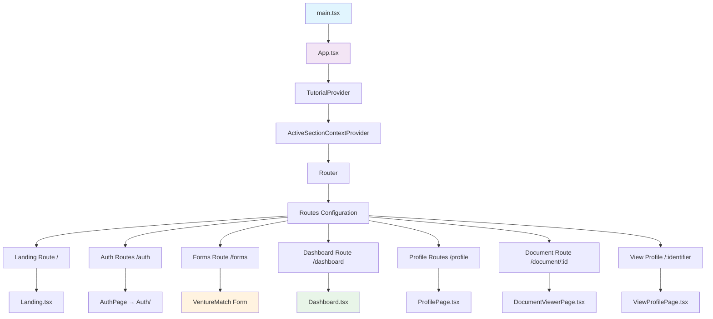
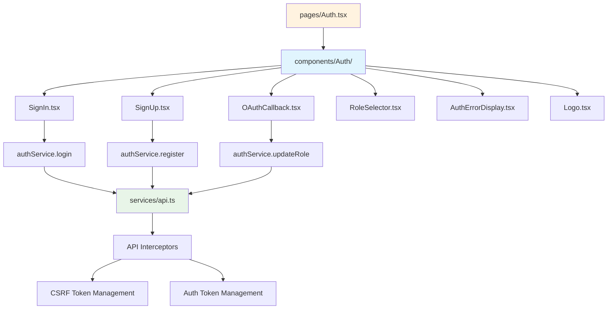
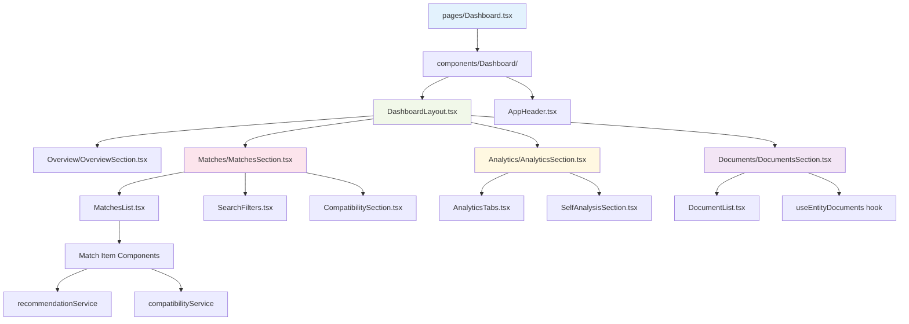
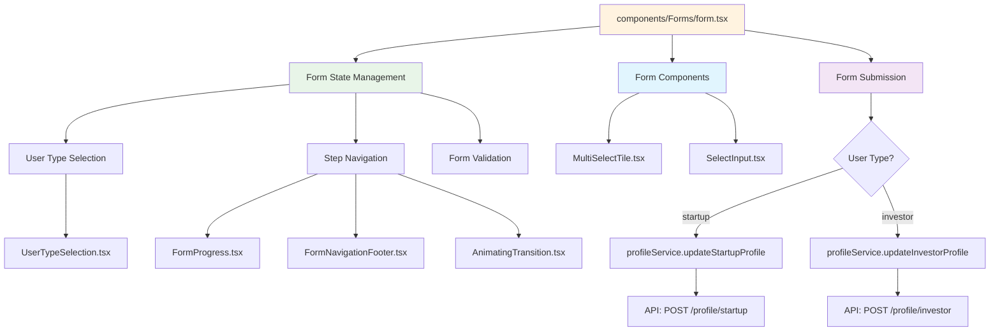
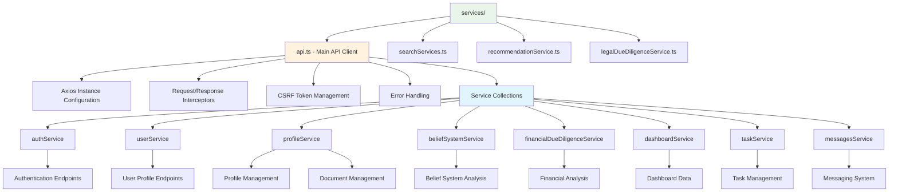
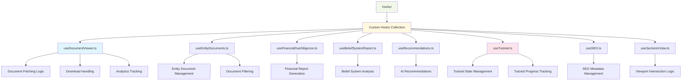
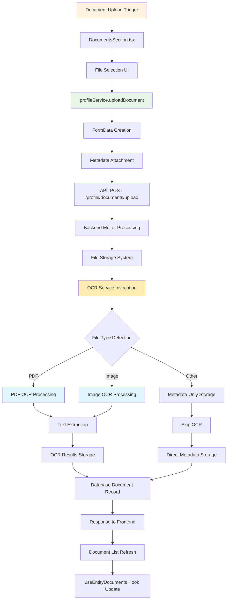
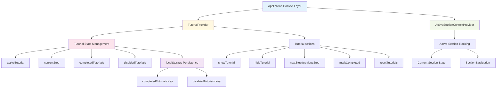

# Frontend File Structure and Component Relationship Analysis

## Frontend Directory Structure Overview

```
Frontend/
├── src/
│   ├── main.tsx                    # Entry point
│   ├── App.tsx                     # Main app component with routing
│   ├── App.css                     # Global styles
│   ├── index.css                   # Base styles
│   ├── vite-env.d.ts              # Vite type definitions
│   │
│   ├── assets/                     # Static assets
│   ├── components/                 # Reusable components
│   │   ├── Analytics/              # Analytics-related components
│   │   ├── Auth/                   # Authentication components
│   │   ├── Charts/                 # Chart components
│   │   ├── ComingSoon/             # Coming soon page
│   │   ├── common/                 # Common utilities
│   │   ├── Dashboard/              # Dashboard components
│   │   ├── DocumentViewer/         # Document viewing components
│   │   ├── Forms/                  # Form components
│   │   ├── Landing/                # Landing page components
│   │   ├── Profile/                # Profile components
│   │   ├── SEO/                    # SEO components
│   │   ├── Tutorial/               # Tutorial system
│   │   └── ui/                     # UI primitives
│   │
│   ├── config/                     # Configuration files
│   ├── constants/                  # Application constants
│   ├── context/                    # React contexts
│   ├── data/                       # Static data
│   ├── design-system/              # Design system components
│   ├── features/                   # Feature-specific components
│   ├── hooks/                      # Custom React hooks
│   ├── pages/                      # Page components
│   ├── services/                   # API services
│   ├── theme/                      # Theme configuration
│   ├── types/                      # TypeScript type definitions
│   └── utils/                      # Utility functions
│
├── public/                         # Public assets
├── docs/                          # Documentation
├── qr_codes/                      # QR code generation
└── [config files]                # Various config files
```

## Component Hierarchy and Relationships

### 1. Core Application Flow



### 2. Authentication Component Hierarchy



### 3. Dashboard Component Architecture



### 4. Forms Component Structure



### 5. Services Layer Architecture



### 6. Hooks Architecture



### 7. Document Processing Flow



### 8. Document Viewer Component Flow

```mermaid
graph TD
    A[DocumentViewerPage.tsx] --> B[useParams Hook]
    B --> C[Extract documentId]
    C --> D[useDocumentViewer Hook]
    
    D --> E[Document Fetch Logic]
    E --> F[API: GET /profile/documents/{id}]
    F --> G[Document Data Processing]
    
    A --> H[Document Display Logic]
    H --> I{File Type Switch}
    I -->|PDF| J[PDF Viewer Component]
    I -->|Image| K[Image Display Component]
    I -->|Other| L[Download Link Component]
    
    A --> M[User Actions]
    M --> N[Download Button]
    M --> O[Copy Link Button]
    M --> P[Document Navigation Dropdown]
    
    N --> Q[handleDownload Function]
    Q --> R[profileService.downloadDocument]
    R --> S[API: GET /profile/documents/{id}/download]
    
    O --> T[Copy to Clipboard]
    P --> U[Navigate to Other Documents]
    
    G --> V[Analytics Recording]
    V --> W[API: POST /analytics/document-view]
    Q --> X[API: POST /analytics/document-download]
    
    style A fill:#e3f2fd
    style D fill:#f1f8e9
    style H fill:#fff8e1
    style M fill:#fce4ec
    style V fill:#f3e5f5
```

### 9. Search and Matching System

```mermaid
graph TD
    A[Search Interface] --> B[SearchFilters Component]
    B --> C[Filter State Management]
    C --> D[industry, stage, location, keywords]
    
    A --> E[Search Execution]
    E --> F{User Role Determination}
    F -->|startup| G[searchInvestors Function]
    F -->|investor| H[searchStartups Function]
    
    G --> I[API: GET /search/investors]
    H --> J[API: GET /search/startups]
    
    I --> K[Investor Results Processing]
    J --> L[Startup Results Processing]
    
    K --> M[MatchesList Component]
    L --> M
    
    M --> N[Individual Match Items]
    N --> O[Match Selection]
    O --> P[Compatibility Analysis Trigger]
    
    P --> Q[fetchCompatibilityData]
    Q --> R[API: GET /score/compatibility/{startup}/{investor}]
    R --> S[CompatibilitySection Display]
    
    N --> T[Recommendation Trigger]
    T --> U[recommendationService.getMatchRecommendations]
    U --> V[API: GET /recommendations/match/{startup}/{investor}]
    
    style A fill:#e8f5e8
    style B fill:#fff3e0
    style E fill:#e1f5fe
    style M fill:#fce4ec
    style S fill:#f1f8e9
```

### 10. Context Providers and State Management



## Key Integration Points

### 1. API Integration Layer
- **api.ts** serves as the central API client
- All services extend from this base client
- Consistent error handling and interceptors
- CSRF token management
- Authentication token management

### 2. State Management Strategy
- **localStorage** for persistent data (auth, preferences)
- **React useState** for component-level state
- **Context API** for cross-component state (tutorials, active sections)
- **Custom hooks** for reusable stateful logic

### 3. Authentication Flow Integration
- Protected routes with authentication checks
- Profile completion verification
- Role-based navigation
- OAuth integration with callback handling

### 4. Document Management System
- Upload → OCR Processing → Storage → Analytics
- Multi-format support (PDF, images, documents)
- Real-time document viewing
- Download tracking and analytics

### 5. Search and Recommendation Engine
- Real-time search with filtering
- Compatibility scoring
- AI-powered recommendations
- Bookmark and matching system

This comprehensive frontend architecture provides a scalable, maintainable foundation for the venture matching platform with advanced document processing capabilities.
