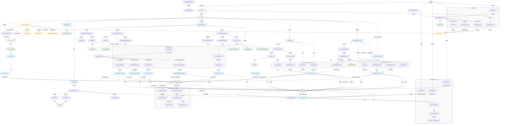

```mermaid
flowchart TB
    %% Main Components
    User([User])
    ReactApp[React Application]
    Router[React Router]
    Pages[Page Components]
    Components[UI Components]
    Hooks[Custom Hooks]
    Services[API Services]
    Context[Context Providers]
    APIClient[Axios API Client]
    BackendAPI[Backend API]
    
    %% Page Components
    LandingPage[Landing Page]
    AuthPage[Auth Page]
    DashboardPage[Dashboard Page]
    ProfilePage[Profile Page]
    QuestionnairePage[Questionnaire Page]
    SharedProfilePage[Shared Profile Page]
    
    %% Component Categories
    AuthComponents[Auth Components]
    DashboardComponents[Dashboard Components]
    ProfileComponents[Profile Components]
    FormComponents[Form Components]
    MatchingComponents[Matching Components]
    AnalysisComponents[Analysis Components]
    LoadingComponents[Loading Components]
    TutorialComponents[Tutorial Components]
    
    %% Specific Components
    LoginForm[Login Form]
    RegisterForm[Register Form]
    OAuthButtons[OAuth Buttons]
    OAuthCallback[OAuth Callback]
    Header[App Header]
    Navigation[Navigation]
    MatchList[Match List]
    MatchDetails[Match Details]
    CompatibilityBreakdown[Compatibility Breakdown]
    AIRecommendations[AI Recommendations]
    BeliefSystemReport[Belief System Report]
    FinancialReport[Financial Report]
    ProfileForm[Profile Form]
    DocumentUpload[Document Upload]
    QuestionnaireForm[Questionnaire Form]
    LoadingSpinner[Loading Spinner]
    TutorialManager[Tutorial Manager]
    
    %% Context Providers
    AuthContext[Auth Context]
    ProfileContext[Profile Context]
    TutorialContext[Tutorial Context]
    ActiveSectionContext[Active Section Context]
    
    %% Custom Hooks
    useAuth[useAuth]
    useProfile[useProfile]
    useQuestionnaire[useQuestionnaire]
    useMatching[useMatching]
    useCompatibility[useCompatibility]
    useBeliefSystem[useBeliefSystem]
    useFinancialDueDiligence[useFinancialDueDiligence]
    useRecommendations[useRecommendations]
    useTutorial[useTutorial]
    useSectionInView[useSectionInView]
    
    %% API Services
    AuthService[Auth Service]
    UserService[User Service]
    ProfileService[Profile Service]
    QuestionnaireService[Questionnaire Service]
    MatchingService[Matching Service]
    CompatibilityService[Compatibility Service]
    BeliefSystemService[Belief System Service]
    FinancialService[Financial Service]
    RecommendationService[Recommendation Service]
    SearchService[Search Service]
    
    %% Main Flow
    User -->|Interacts with| ReactApp
    ReactApp -->|Routes to| Router
    Router -->|Renders| Pages
    Pages -->|Composed of| Components
    Components -->|Use| Hooks
    Hooks -->|Call| Services
    Services -->|Use| APIClient
    APIClient -->|Requests to| BackendAPI
    Context -->|Provides State to| Pages
    Context -->|Provides State to| Components
    
    %% Routing Flow
    Router -->|/| LandingPage
    Router -->|/auth| AuthPage
    Router -->|/dashboard| DashboardPage
    Router -->|/profile| ProfilePage
    Router -->|/question| QuestionnairePage
    Router -->|/shared-profile/:token| SharedProfilePage
    
    %% Page to Component Flow
    AuthPage -->|Renders| AuthComponents
    DashboardPage -->|Renders| DashboardComponents
    DashboardPage -->|Renders| MatchingComponents
    DashboardPage -->|Renders| AnalysisComponents
    ProfilePage -->|Renders| ProfileComponents
    QuestionnairePage -->|Renders| FormComponents
    
    %% Component Breakdown
    AuthComponents -->|Contains| LoginForm
    AuthComponents -->|Contains| RegisterForm
    AuthComponents -->|Contains| OAuthButtons
    AuthComponents -->|Contains| OAuthCallback
    
    DashboardComponents -->|Contains| Header
    DashboardComponents -->|Contains| Navigation
    
    MatchingComponents -->|Contains| MatchList
    MatchingComponents -->|Contains| MatchDetails
    MatchingComponents -->|Contains| CompatibilityBreakdown
    
    AnalysisComponents -->|Contains| AIRecommendations
    AnalysisComponents -->|Contains| BeliefSystemReport
    AnalysisComponents -->|Contains| FinancialReport
    
    ProfileComponents -->|Contains| ProfileForm
    ProfileComponents -->|Contains| DocumentUpload
    
    FormComponents -->|Contains| QuestionnaireForm
    
    LoadingComponents -->|Contains| LoadingSpinner
    
    TutorialComponents -->|Contains| TutorialManager
    
    %% Context Providers
    Context -->|Auth State| AuthContext
    Context -->|Profile Data| ProfileContext
    Context -->|Tutorial State| TutorialContext
    Context -->|Active Section| ActiveSectionContext
    
    %% Hook Usage
    LoginForm -->|Uses| useAuth
    RegisterForm -->|Uses| useAuth
    ProfileForm -->|Uses| useProfile
    QuestionnaireForm -->|Uses| useQuestionnaire
    MatchList -->|Uses| useMatching
    CompatibilityBreakdown -->|Uses| useCompatibility
    BeliefSystemReport -->|Uses| useBeliefSystem
    FinancialReport -->|Uses| useFinancialDueDiligence
    AIRecommendations -->|Uses| useRecommendations
    TutorialManager -->|Uses| useTutorial
    LandingPage -->|Uses| useSectionInView
    
    %% Service to API Client Flow
    AuthService -->|Login/Register| APIClient
    UserService -->|Get User Data| APIClient
    ProfileService -->|Manage Profiles| APIClient
    QuestionnaireService -->|Submit Responses| APIClient
    MatchingService -->|Find Matches| APIClient
    CompatibilityService -->|Get Compatibility| APIClient
    BeliefSystemService -->|Get Analysis| APIClient
    FinancialService -->|Get Reports| APIClient
    RecommendationService -->|Get Recommendations| APIClient
    SearchService -->|Search Entities| APIClient
    
    %% Authentication Flow
    subgraph AuthFlow [Authentication Flow]
        UserLogin[User Login]
        UserRegister[User Register]
        OAuthLogin[OAuth Login]
        StoreToken[Store JWT Token]
        SetAuthHeader[Set Auth Header]
        RedirectToDashboard[Redirect to Dashboard]
    end
    
    User -->|Login| UserLogin
    UserLogin -->|Submit Credentials| AuthService
    AuthService -->|Validate| BackendAPI
    BackendAPI -->|Return Token| AuthService
    AuthService -->|Store| StoreToken
    StoreToken -->|Set| SetAuthHeader
    SetAuthHeader -->|Redirect| RedirectToDashboard
    
    User -->|Register| UserRegister
    UserRegister -->|Submit Details| AuthService
    
    User -->|OAuth| OAuthLogin
    OAuthLogin -->|Redirect to Provider| BackendAPI
    BackendAPI -->|Callback with Token| OAuthCallback
    OAuthCallback -->|Store| StoreToken
    
    %% Profile Management Flow
    subgraph ProfileFlow [Profile Management Flow]
        FetchProfile[Fetch Profile]
        UpdateProfile[Update Profile]
        UploadProfileDocument[Upload Document]
        ShareProfile[Share Profile]
        ViewSharedProfile[View Shared Profile]
    end
    
    ProfilePage -->|Load| FetchProfile
    FetchProfile -->|Get Data| ProfileService
    ProfileService -->|Fetch| BackendAPI
    
    ProfileForm -->|Submit| UpdateProfile
    UpdateProfile -->|Save| ProfileService
    ProfileService -->|Update| BackendAPI
    
    DocumentUpload -->|Upload| UploadProfileDocument
    UploadProfileDocument -->|Send File| ProfileService
    ProfileService -->|Upload| BackendAPI
    
    ProfilePage -->|Share| ShareProfile
    ShareProfile -->|Generate Link| ProfileService
    ProfileService -->|Create Token| BackendAPI
    
    SharedProfilePage -->|View| ViewSharedProfile
    ViewSharedProfile -->|Validate Token| ProfileService
    ProfileService -->|Get Data| BackendAPI
    
    %% Dashboard Flow
    subgraph DashboardFlow [Dashboard Flow]
        LoadDashboard[Load Dashboard]
        FetchMatches[Fetch Matches]
        SelectMatch[Select Match]
        ViewCompatibility[View Compatibility]
        ViewBeliefSystem[View Belief System]
        ViewFinancials[View Financials]
        ViewRecommendations[View Recommendations]
    end
    
    DashboardPage -->|Initialize| LoadDashboard
    LoadDashboard -->|Get Matches| FetchMatches
    FetchMatches -->|Call API| MatchingService
    MatchingService -->|Fetch| BackendAPI
    
    MatchList -->|Select| SelectMatch
    SelectMatch -->|Show Details| MatchDetails
    
    MatchDetails -->|View Compatibility| ViewCompatibility
    ViewCompatibility -->|Get Data| CompatibilityService
    CompatibilityService -->|Fetch| BackendAPI
    
    MatchDetails -->|View Belief System| ViewBeliefSystem
    ViewBeliefSystem -->|Get Analysis| BeliefSystemService
    BeliefSystemService -->|Fetch| BackendAPI
    
    MatchDetails -->|View Financials| ViewFinancials
    ViewFinancials -->|Get Reports| FinancialService
    FinancialService -->|Fetch| BackendAPI
    
    MatchDetails -->|View Recommendations| ViewRecommendations
    ViewRecommendations -->|Get Data| RecommendationService
    RecommendationService -->|Fetch| BackendAPI
    
    %% Questionnaire Flow
    subgraph QuestionnaireFlow [Questionnaire Flow]
        LoadQuestionnaire[Load Questionnaire]
        SaveDraft[Save Draft]
        SubmitResponses[Submit Responses]
        ViewResults[View Results]
    end
    
    QuestionnairePage -->|Initialize| LoadQuestionnaire
    LoadQuestionnaire -->|Get Status| QuestionnaireService
    QuestionnaireService -->|Fetch| BackendAPI
    
    QuestionnaireForm -->|Save Progress| SaveDraft
    SaveDraft -->|Store Draft| QuestionnaireService
    QuestionnaireService -->|Save| BackendAPI
    
    QuestionnaireForm -->|Complete| SubmitResponses
    SubmitResponses -->|Submit| QuestionnaireService
    QuestionnaireService -->|Send| BackendAPI
    
    QuestionnairePage -->|After Submit| ViewResults
    ViewResults -->|Show Analysis| QuestionnairePage
    
    %% API Client Interceptors
    subgraph APIInterceptors [API Client Interceptors]
        RequestInterceptor[Request Interceptor]
        ResponseInterceptor[Response Interceptor]
        AddAuthHeader[Add Auth Header]
        HandleAuthError[Handle Auth Error]
        RefreshToken[Refresh Token]
        RedirectToLogin[Redirect to Login]
    end
    
    APIClient -->|Before Request| RequestInterceptor
    RequestInterceptor -->|Add Token| AddAuthHeader
    
    APIClient -->|After Response| ResponseInterceptor
    ResponseInterceptor -->|401 Error| HandleAuthError
    HandleAuthError -->|Try Refresh| RefreshToken
    HandleAuthError -->|Failed| RedirectToLogin
    
    %% Tutorial System
    subgraph TutorialSystem [Tutorial System]
        InitTutorials[Initialize Tutorials]
        ShowTutorial[Show Tutorial]
        NextStep[Next Step]
        CompleteTutorial[Complete Tutorial]
        DisableTutorial[Disable Tutorial]
    end
    
    ReactApp -->|Initialize| InitTutorials
    InitTutorials -->|Register| TutorialContext
    
    User -->|First Visit| ShowTutorial
    ShowTutorial -->|Display| TutorialManager
    
    TutorialManager -->|User Clicks Next| NextStep
    NextStep -->|Update| TutorialContext
    
    TutorialManager -->|Last Step| CompleteTutorial
    CompleteTutorial -->|Mark Complete| TutorialContext
    
    TutorialManager -->|User Dismisses| DisableTutorial
    DisableTutorial -->|Disable| TutorialContext
    
    %% Styling
    classDef component fill:#f9f9f9,stroke:#333,stroke-width:1px;
    classDef page fill:#e3f2fd,stroke:#1565c0,stroke-width:1px;
    classDef service fill:#e1f5fe,stroke:#0288d1,stroke-width:1px;
    classDef hook fill:#e8f5e9,stroke:#388e3c,stroke-width:1px;
    classDef context fill:#fff8e1,stroke:#ffa000,stroke-width:1px;
    classDef api fill:#f3e5f5,stroke:#7b1fa2,stroke-width:1px;
    
    class ReactApp,Router,Components,User component;
    class LandingPage,AuthPage,DashboardPage,ProfilePage,QuestionnairePage,SharedProfilePage page;
    class Services,AuthService,UserService,ProfileService,QuestionnaireService,MatchingService,CompatibilityService,BeliefSystemService,FinancialService,RecommendationService,SearchService service;
    class Hooks,useAuth,useProfile,useQuestionnaire,useMatching,useCompatibility,useBeliefSystem,useFinancialDueDiligence,useRecommendations,useTutorial,useSectionInView hook;
    class Context,AuthContext,ProfileContext,TutorialContext,ActiveSectionContext context;
    class APIClient,BackendAPI api;
    
    %% Subgraph Styling
    style AuthFlow fill:#f9f9f9,stroke:#333,stroke-width:1px;
    style ProfileFlow fill:#f9f9f9,stroke:#333,stroke-width:1px;
    style DashboardFlow fill:#f9f9f9,stroke:#333,stroke-width:1px;
    style QuestionnaireFlow fill:#f9f9f9,stroke:#333,stroke-width:1px;
    style APIInterceptors fill:#f9f9f9,stroke:#333,stroke-width:1px;
    style TutorialSystem fill:#f9f9f9,stroke:#333,stroke-width:1px;
```
