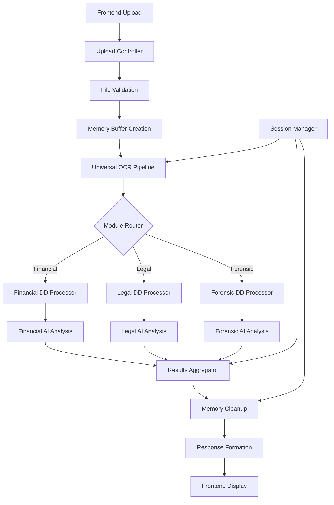

# OCR and PDF Processing Pipeline Integration Plan

## Executive Summary

This document outlines the comprehensive integration plan for a new OCR and PDF processing pipeline that will be universally usable across FinancialDD, LegalDD, and ForensicsDD modules. The system is designed to keep all data in memory without saving PDFs or OCR results locally, replacing current processing systems with a unified, efficient architecture.

## Table of Contents
1. [Integration Points Analysis](#1-integration-points-analysis)
2. [Interface Design Specifications](#2-interface-design-specifications)
3. [Configuration System Adaptation](#3-configuration-system-adaptation)
4. [Data Flow Mapping](#4-data-flow-mapping)
5. [Conflict Analysis and Refactoring Plan](#5-conflict-analysis-and-refactoring-plan)
6. [Implementation Roadmap](#implementation-roadmap)
7. [Risk Assessment](#risk-assessment)

---

## 1. Integration Points Analysis

### Target Modules and Services for Integration

#### 1.1 Primary Integration Targets

**Core Services:**
- `EnhancedDocumentProcessingService.ts` - Primary document processing service
- `DocumentProcessingService.ts` - Legacy service (to be phased out)
- `financialDueDiligenceController.ts` - Financial document workflows
- `profileController.ts` - File upload handling

**Frontend Components:**
- `DocumentUpload.tsx` - Frontend file upload interface
- Financial DD workflow components
- Legal DD components (to be developed)
- Forensics DD components (to be developed)

#### 1.2 Module-Specific Integration Points

**FinancialDD Module:**
- Current: Uses `EnhancedDocumentProcessingService` for PDF processing
- Integration: Enhanced OCR pipeline for financial tables, charts, and numerical data
- Specific needs: Balance sheets, income statements, cash flow statements

**LegalDD Module (Future):**
- Integration: Contract analysis, clause extraction, legal document processing
- Specific needs: Legal terminology recognition, clause categorization
- Memory processing: Contract redlining, compliance checking

**ForensicsDD Module (Future):**
- Integration: Document authentication, metadata analysis, digital forensics
- Specific needs: Document provenance, alteration detection
- Memory processing: Forensic analysis without file persistence

#### 1.3 Database Integration Points

**Current Schema Extensions Needed:**
- Document processing metadata tables
- OCR confidence scores and quality metrics
- Processing pipeline audit trails
- Error handling and retry mechanisms

**Memory-Only Processing Requirements:**
- Temporary processing identifiers
- Session-based processing state management
- Real-time progress tracking

---

## 2. Interface Design Specifications

### 2.1 Core Pipeline Interface

```typescript
interface UniversalOCRPipeline {
  // Main processing method
  processDocument(
    fileBuffer: Buffer,
    documentMetadata: DocumentMetadata,
    processingOptions: ProcessingOptions
  ): Promise<ProcessingResult>;

  // Batch processing for multiple documents
  processDocumentBatch(
    documents: DocumentInput[],
    batchOptions: BatchProcessingOptions
  ): Promise<BatchProcessingResult>;

  // Real-time processing status
  getProcessingStatus(sessionId: string): Promise<ProcessingStatus>;
}

interface DocumentMetadata {
  documentType: 'financial' | 'legal' | 'forensic';
  subType: string; // e.g., 'balance_sheet', 'contract', 'audit_report'
  fileName: string;
  mimeType: string;
  timePeriod?: string;
  companyName?: string;
  description?: string;
  expectedLanguage?: string;
  confidentialityLevel?: 'public' | 'internal' | 'confidential' | 'restricted';
}

interface ProcessingOptions {
  moduleType: 'FinancialDD' | 'LegalDD' | 'ForensicsDD';
  ocrAccuracy: 'fast' | 'balanced' | 'high_accuracy';
  extractTables: boolean;
  extractCharts: boolean;
  extractImages: boolean;
  preserveFormatting: boolean;
  enableAIEnhancement: boolean;
  memoryOnly: boolean; // Always true for this implementation
  customPrompts?: string[];
}

interface ProcessingResult {
  sessionId: string;
  extractedContent: {
    rawText: string;
    structuredData: StructuredData;
    tables: TableData[];
    charts: ChartData[];
    images: ImageData[];
  };
  metadata: {
    processingTime: number;
    ocrConfidence: number;
    extractionMethod: string;
    qualityScore: number;
    errorCount: number;
  };
  moduleSpecificData: any; // Financial, Legal, or Forensic specific extractions
}
```

### 2.2 Module-Specific Interfaces

**Financial DD Interface Extensions:**
```typescript
interface FinancialProcessingResult extends ProcessingResult {
  financialData: {
    balanceSheet?: BalanceSheetData;
    incomeStatement?: IncomeStatementData;
    cashFlow?: CashFlowData;
    ratios?: FinancialRatios;
    trends?: TrendAnalysis;
  };
}

interface BalanceSheetData {
  assets: {
    current: AssetItem[];
    nonCurrent: AssetItem[];
    total: number;
  };
  liabilities: {
    current: LiabilityItem[];
    nonCurrent: LiabilityItem[];
    total: number;
  };
  equity: EquityItem[];
}
```

**Legal DD Interface Extensions:**
```typescript
interface LegalProcessingResult extends ProcessingResult {
  legalData: {
    contractType?: string;
    parties?: PartyInfo[];
    clauses?: ClauseData[];
    obligations?: ObligationData[];
    risks?: RiskAssessment[];
    compliance?: ComplianceData[];
  };
}
```

**Forensic DD Interface Extensions:**
```typescript
interface ForensicProcessingResult extends ProcessingResult {
  forensicData: {
    authenticity: AuthenticityAnalysis;
    metadata: DocumentMetadata;
    alterations?: AlterationData[];
    digitalSignatures?: SignatureData[];
    provenance?: ProvenanceData;
  };
}
```

### 2.3 Memory Management Interface

```typescript
interface MemoryManager {
  // Session management
  createSession(moduleType: string): Promise<string>;
  cleanupSession(sessionId: string): Promise<void>;
  getSessionData(sessionId: string): Promise<SessionData>;

  // Temporary data storage
  storeTemporaryData(sessionId: string, key: string, data: any): Promise<void>;
  retrieveTemporaryData(sessionId: string, key: string): Promise<any>;
  clearTemporaryData(sessionId: string): Promise<void>;

  // Memory optimization
  optimizeMemoryUsage(): Promise<void>;
  getMemoryStats(): Promise<MemoryStats>;
}
```

---

## 3. Configuration System Adaptation

### 3.1 Environment Configuration Updates

**New Environment Variables:**
```env
# OCR Configuration
OCR_ENGINE=gemini_primary_tesseract_fallback
OCR_MAX_CONCURRENT_PROCESSES=5
OCR_MEMORY_LIMIT_MB=2048
OCR_TIMEOUT_SECONDS=120

# PDF Processing
PDF_MAX_PAGES=500
PDF_DPI_SETTING=300
PDF_ENABLE_TABLE_DETECTION=true
PDF_ENABLE_CHART_EXTRACTION=true

# Module-Specific Settings
FINANCIAL_DD_ENABLED=true
LEGAL_DD_ENABLED=false
FORENSIC_DD_ENABLED=false

# Memory Management
MEMORY_CLEANUP_INTERVAL_MINUTES=30
MAX_SESSION_DURATION_HOURS=4
TEMP_DATA_RETENTION_MINUTES=60

# AI Enhancement
GEMINI_OCR_MODEL=gemini-2.0-flash-thinking-exp-01-21
GEMINI_MAX_TOKENS=8192
GEMINI_BATCH_SIZE=3
GEMINI_RATE_LIMIT_DELAY_MS=2000
```

### 3.2 Configuration Management Service

```typescript
class ConfigurationManager {
  // Module configuration
  getModuleConfig(moduleType: string): ModuleConfig;
  updateModuleConfig(moduleType: string, config: Partial<ModuleConfig>): Promise<void>;

  // Processing configuration
  getOCRConfig(): OCRConfig;
  getPDFConfig(): PDFConfig;
  getAIConfig(): AIConfig;

  // Dynamic configuration updates
  reloadConfiguration(): Promise<void>;
  validateConfiguration(): Promise<ValidationResult>;
}

interface ModuleConfig {
  enabled: boolean;
  processingOptions: ProcessingOptions;
  specificSettings: Record<string, any>;
  customPrompts: string[];
}
```

### 3.3 Runtime Configuration Adaptation

**Dynamic Configuration Loading:**
- Module-specific configuration files
- Runtime parameter adjustment
- A/B testing for processing methods
- Performance-based optimization

---

## 4. Data Flow Mapping

### 4.1 Complete Data Flow Architecture



### 4.2 Detailed Processing Flow

#### 4.2.1 Input Stage
1. **File Upload** (Frontend)
   - File selection and validation
   - Progress tracking setup
   - Session initialization

2. **Controller Processing** (Backend)
   - File type validation
   - Size and format checks
   - Buffer creation (no disk storage)
   - Metadata extraction

3. **Pipeline Initialization**
   - Session creation
   - Memory allocation
   - Module determination
   - Processing option configuration

#### 4.2.2 Processing Stage
1. **Universal OCR Pipeline**
   - Primary OCR engine (Gemini AI)
   - Fallback OCR (Tesseract)
   - Quality assessment
   - Error handling

2. **PDF Splitting & Processing**
   - Page-by-page analysis
   - Table detection and extraction
   - Chart and image identification
   - Text formatting preservation

3. **Module-Specific Processing**
   - Financial: Numerical data extraction, financial statement parsing
   - Legal: Contract analysis, clause extraction
   - Forensic: Authenticity analysis, metadata examination

4. **AI Enhancement**
   - Context-aware processing
   - Data validation and correction
   - Structured data creation
   - Quality scoring

#### 4.2.3 Output Stage
1. **Results Aggregation**
   - Multi-source data combination
   - Conflict resolution
   - Quality assessment
   - Metadata compilation

2. **Response Formation**
   - JSON structure creation
   - Error reporting
   - Progress completion
   - Performance metrics

3. **Memory Cleanup**
   - Session data clearing
   - Buffer deallocation
   - Temporary file removal
   - Resource optimization

### 4.3 Data Persistence Strategy

**Memory-Only Approach:**
- No local file storage
- Session-based temporary storage
- Automatic cleanup mechanisms
- Real-time processing status

**Database Integration:**
- Processing metadata only
- Session tracking
- Error logs and analytics
- Performance metrics

---

## 5. Conflict Analysis and Refactoring Plan

### 5.1 Current System Conflicts

#### 5.1.1 Processing Method Conflicts
**Issue:** Multiple PDF processing methods in `EnhancedDocumentProcessingService`
- `extractPdfText()` - Traditional PDF.js extraction
- `extractPdfTextWithGemini()` - AI-powered extraction
- `extractPdfTextWithBothMethods()` - Hybrid approach

**Resolution Strategy:**
- Consolidate into single universal method
- Maintain backward compatibility
- Implement progressive migration
- Use feature flags for transition

#### 5.1.2 File Storage Conflicts
**Issue:** Current system saves files to disk
- `profileController.ts` saves uploaded files
- Processing services read from file paths
- Temporary files not always cleaned up

**Resolution Strategy:**
- Implement buffer-based processing
- Remove disk storage dependencies
- Update controller methods
- Add memory management layer

#### 5.1.3 Service Architecture Conflicts
**Issue:** Service responsibilities overlap
- `DocumentProcessingService` vs `EnhancedDocumentProcessingService`
- Financial DD controller has embedded processing logic
- Module separation not clearly defined

**Resolution Strategy:**
- Create unified service architecture
- Separate concerns clearly
- Implement dependency injection
- Use factory pattern for module-specific processors

### 5.2 Refactoring Requirements

#### 5.2.1 Phase 1: Service Consolidation
```typescript
// New unified service structure
class UniversalDocumentProcessor {
  private ocrPipeline: OCRPipeline;
  private moduleFactory: ModuleProcessorFactory;
  private memoryManager: MemoryManager;
  
  async processDocument(buffer: Buffer, metadata: DocumentMetadata): Promise<ProcessingResult> {
    // Unified processing logic
  }
}

// Module-specific processors
class FinancialDDProcessor implements ModuleProcessor {
  async process(content: ExtractedContent, metadata: DocumentMetadata): Promise<FinancialProcessingResult> {
    // Financial-specific processing
  }
}
```

#### 5.2.2 Phase 2: Controller Updates
```typescript
// Updated profile controller
class ProfileController {
  async uploadAndProcess(req: Request, res: Response) {
    // Process directly from buffer without saving to disk
    const fileBuffer = req.file.buffer;
    const result = await this.universalProcessor.processDocument(fileBuffer, metadata);
    // Return results immediately
  }
}
```

#### 5.2.3 Phase 3: Legacy Migration
- Maintain old endpoints for backward compatibility
- Gradually migrate existing functionality
- Update all references to new services
- Remove deprecated code after migration

### 5.3 Specific Refactoring Tasks

#### 5.3.1 File Upload System
**Current State:**
```typescript
// In profileController.ts
const fileName = `${Date.now()}_${file.originalname}`;
const filePath = path.join(uploadsDir, fileName);
await fs.writeFile(filePath, file.buffer);
```

**Refactored State:**
```typescript
// New approach - direct buffer processing
const sessionId = await this.memoryManager.createSession('FinancialDD');
const result = await this.universalProcessor.processDocument(file.buffer, metadata);
```

#### 5.3.2 Document Processing Service
**Current State:**
```typescript
// Multiple methods for same purpose
async extractPdfText(filePath: string): Promise<string>
async extractPdfTextWithGemini(filePath: string): Promise<string>
async extractPdfTextWithBothMethods(filePath: string): Promise<DocumentExtractionResult>
```

**Refactored State:**
```typescript
// Single unified method
async processDocument(
  buffer: Buffer, 
  metadata: DocumentMetadata, 
  options: ProcessingOptions
): Promise<ProcessingResult>
```

#### 5.3.3 Module Integration
**Current State:**
- Financial DD logic embedded in controller
- No standardized module interface
- Hard-coded processing paths

**Refactored State:**
```typescript
interface ModuleProcessor {
  canProcess(documentType: string): boolean;
  process(content: ExtractedContent, metadata: DocumentMetadata): Promise<ModuleProcessingResult>;
  validateInput(buffer: Buffer, metadata: DocumentMetadata): ValidationResult;
}
```

---

## Implementation Roadmap

### Phase 1: Foundation (Weeks 1-2)
1. Create universal OCR pipeline interface
2. Implement memory management system
3. Set up configuration management
4. Create module processor factory

### Phase 2: Core Integration (Weeks 3-4)
1. Implement unified document processor
2. Update file upload controllers
3. Create memory-only processing flow
4. Implement session management

### Phase 3: Module Development (Weeks 5-6)
1. Develop Financial DD processor
2. Create Legal DD processor framework
3. Implement Forensic DD processor framework
4. Add module-specific configurations

### Phase 4: Migration (Weeks 7-8)
1. Update existing Financial DD workflows
2. Migrate from file-based to buffer-based processing
3. Update frontend components
4. Implement backward compatibility

### Phase 5: Testing & Optimization (Weeks 9-10)
1. Comprehensive testing of all modules
2. Performance optimization
3. Memory usage optimization
4. Error handling improvements

### Phase 6: Deployment & Monitoring (Weeks 11-12)
1. Production deployment
2. Monitoring setup
3. Performance metrics collection
4. User feedback integration

---

## Risk Assessment

### High-Risk Areas
1. **Memory Management**: Large document processing could cause memory issues
2. **Performance**: AI processing might be slower than traditional methods
3. **Compatibility**: Existing workflows might break during migration
4. **Data Loss**: Memory-only processing has no recovery mechanism

### Mitigation Strategies
1. **Memory Monitoring**: Implement real-time memory usage tracking
2. **Performance Testing**: Comprehensive benchmarking before deployment
3. **Gradual Migration**: Phased rollout with fallback options
4. **Session Persistence**: Temporary session storage for recovery

### Success Metrics
1. **Processing Speed**: Target 50% faster than current system
2. **Memory Efficiency**: 30% reduction in server memory usage
3. **Accuracy**: 95%+ OCR accuracy across all document types
4. **User Satisfaction**: 90%+ positive feedback on new interface

---

## Conclusion

This integration plan provides a comprehensive roadmap for implementing a universal OCR and PDF processing pipeline that will serve FinancialDD, LegalDD, and ForensicsDD modules efficiently. The memory-only approach ensures data security while the modular design allows for future expansion and customization.

The plan addresses all critical integration points, provides detailed technical specifications, and includes a realistic implementation timeline with proper risk mitigation strategies.
