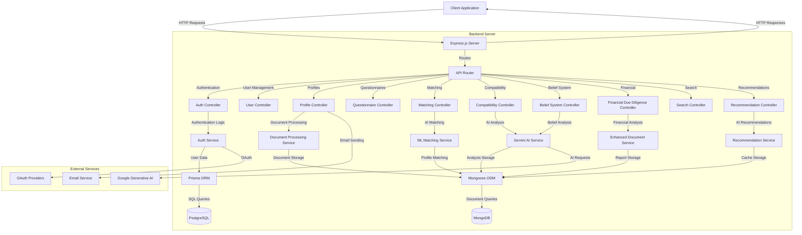
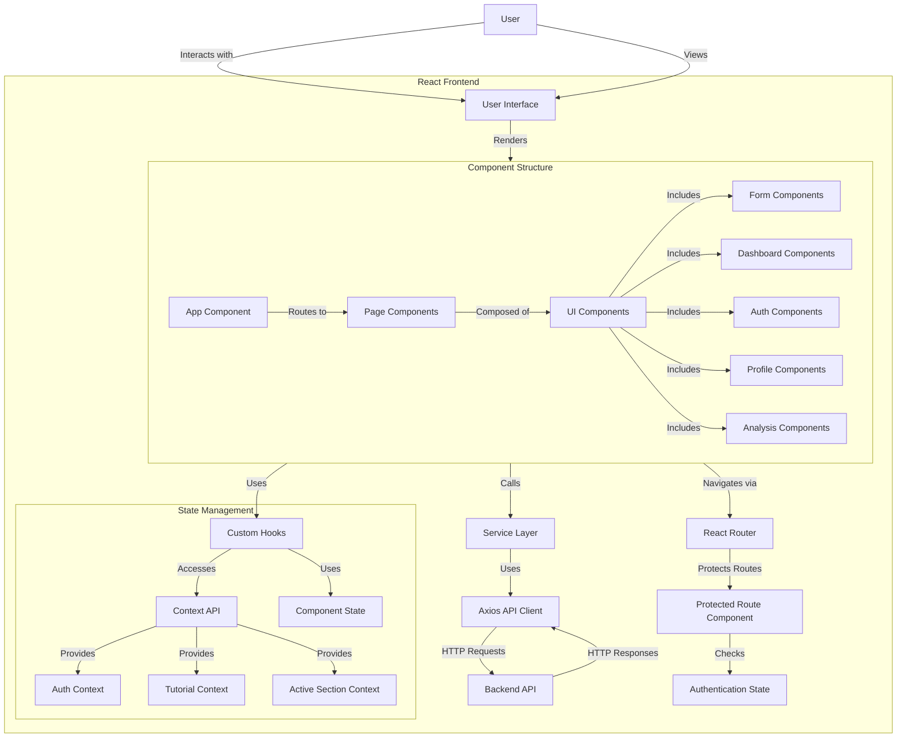

# KarmicDD System Architecture

## Table of Contents
1. [Executive Summary](#executive-summary)
2. [System Overview](#system-overview)
3. [Backend Architecture](#backend-architecture)
   - [Technology Stack](#backend-technology-stack)
   - [Server Configuration](#server-configuration)
   - [Database Architecture](#database-architecture)
   - [Authentication System](#authentication-system)
   - [API Structure](#api-structure)
   - [Services and Controllers](#services-and-controllers)
   - [Error Handling](#error-handling)
4. [Frontend Architecture](#frontend-architecture)
   - [Technology Stack](#frontend-technology-stack)
   - [Component Structure](#component-structure)
   - [State Management](#state-management)
   - [Routing System](#routing-system)
   - [Service Layer](#service-layer)
5. [Integration Architecture](#integration-architecture)
   - [API Communication Flow](#api-communication-flow)
   - [Authentication Flow](#authentication-flow)
   - [Data Flow for Key Features](#data-flow-for-key-features)
   - [Error Handling and Security](#error-handling-and-security)
6. [Architecture Diagrams](#architecture-diagrams)
   - [Backend Data and Process Flow](#backend-data-and-process-flow)
   - [Frontend Flow](#frontend-flow)
   - [Integration and Microservices Flow](#integration-and-microservices-flow)

## Executive Summary

KarmicDD is a comprehensive AI-powered due diligence platform designed for startups and investors in the Indian ecosystem. The platform facilitates connections between startups and potential investors through profile matching, questionnaires, and AI-driven analysis. The system architecture employs a modern, scalable approach with a clear separation between frontend and backend components.

The backend is built on Node.js with TypeScript, utilizing a hybrid database approach with PostgreSQL for relational data and MongoDB for rich, flexible document storage. The frontend is developed with React and TypeScript, providing a responsive and intuitive user interface. The system leverages Google's Generative AI (Gemini) for intelligent analysis of profiles, documents, and compatibility between startups and investors.

This document provides a detailed overview of the system architecture, including the backend and frontend components, database design, API structure, and integration patterns.

## System Overview

KarmicDD is structured as a client-server application with the following high-level components:

1. **Frontend Application**: A React-based single-page application (SPA) that provides the user interface for startups and investors.

2. **Backend API Server**: A Node.js/Express server that handles API requests, business logic, and data persistence.

3. **Database Systems**:
   - **PostgreSQL**: Handles user authentication, core relationship data, and structured information.
   - **MongoDB**: Stores rich profile data, questionnaire responses, analysis results, and documents.

4. **External Services**:
   - **Google Generative AI (Gemini)**: Provides AI-powered analysis for compatibility matching, belief system analysis, and financial due diligence.
   - **OAuth Providers**: Supports authentication via Google and LinkedIn.
   - **Email Service**: Handles email notifications and sharing functionality.

The system follows a microservice-inspired architecture where different functional areas are organized into distinct services, though they are deployed as a monolithic application for simplicity in the current implementation.

## Backend Architecture

### Backend Technology Stack

The backend of KarmicDD is built with the following technologies:

- **Runtime Environment**: Node.js
- **Programming Language**: TypeScript
- **Web Framework**: Express.js
- **API Documentation**: Swagger/OpenAPI
- **Authentication**: JWT (JSON Web Tokens), Passport.js for OAuth
- **Primary Database**: PostgreSQL with Prisma ORM
- **Secondary Database**: MongoDB with Mongoose ODM
- **AI Integration**: Google Generative AI (Gemini API)
- **File Processing**: Various libraries for document parsing (PDF, XLSX, DOCX)
- **Security**: Helmet for HTTP headers, bcrypt for password hashing
- **Validation**: Express Validator
- **Email**: Resend API

### Server Configuration

The backend server is configured with the following middleware and settings:

1. **Express Application**: The core server is an Express.js application that handles HTTP requests and responses.

2. **Middleware**:
   - **Helmet**: Enhances security by setting various HTTP headers.
   - **CORS**: Configured to allow requests from the frontend application.
   - **Body Parser**: Parses JSON request bodies.
   - **Cookie Parser**: Handles HTTP cookies for authentication.
   - **Custom Logging**: Tracks request counts and response times.

3. **Error Handling**: A global error handler middleware captures and formats errors consistently.

4. **API Documentation**: Swagger UI is mounted at `/api-docs` to provide interactive API documentation.

5. **Environment Configuration**: Environment variables are loaded from a `.env` file using dotenv.

### Database Architecture

KarmicDD employs a hybrid database approach to leverage the strengths of both relational and document databases:

#### PostgreSQL (Relational Database)

PostgreSQL is used for structured data with well-defined relationships:

1. **User Management**:
   - `users` table: Stores user authentication data, including email, password hash, OAuth information, and role.
   - `profile_shares` table: Manages shareable profile links with expiration dates and view counts.

2. **Schema Management**: Prisma is used as the ORM (Object-Relational Mapping) tool to define and manage the database schema.

#### MongoDB (Document Database)

MongoDB is used for flexible, schema-less data that may evolve over time:

1. **Profile Data**:
   - `StartupProfile`: Stores startup company information (company name, industry, funding stage, etc.).
   - `InvestorProfile`: Stores investor information (company name, industries of interest, preferred stages, etc.).
   - `ExtendedProfile`: Contains additional profile data like social links, team members, and investment history.

2. **Documents**:
   - `Document`: Stores metadata about uploaded documents, with the actual files stored in the filesystem.

3. **Questionnaires and Analysis**:
   - `QuestionnaireSubmission`: Stores user responses to questionnaires.
   - `MatchAnalysis`: Contains compatibility analysis between startups and investors.
   - `BeliefSystemAnalysis`: Stores detailed belief system analysis reports.
   - `FinancialDueDiligenceReport`: Contains financial due diligence reports.
   - `Recommendation`: Stores AI-generated recommendations for startup-investor matches.

4. **API Usage Tracking**:
   - `ApiUsage`: Tracks API usage for rate limiting purposes.

5. **Schema Management**: Mongoose is used as the ODM (Object-Document Mapping) tool to define schemas and interact with MongoDB.

### Authentication System

The authentication system in KarmicDD provides multiple ways for users to authenticate:

1. **Local Authentication**:
   - Users can register and login with email and password.
   - Passwords are hashed using bcrypt before storage.
   - JWT (JSON Web Tokens) are issued upon successful authentication.

2. **OAuth Authentication**:
   - Integration with Google OAuth 2.0 for Google account login.
   - Integration with LinkedIn OAuth 2.0 for LinkedIn account login.
   - Passport.js is used to handle OAuth flows.

3. **Authentication Middleware**:
   - `authenticateJWT`: Verifies JWT tokens in request headers, cookies, or query parameters.
   - `authorizeRole`: Ensures users have the appropriate role for accessing specific endpoints.

4. **Token Management**:
   - Tokens are stored in the client's localStorage.
   - The frontend includes token refresh logic to maintain sessions.

### API Structure

The API follows a RESTful design pattern organized by functional domains:

1. **Authentication API** (`/api/auth`):
   - User registration and login
   - OAuth callback handling
   - Role selection for OAuth users

2. **User API** (`/api/users`):
   - User profile management
   - Dashboard data retrieval

3. **Profile API** (`/api/profile`):
   - Startup and investor profile creation and updates
   - Extended profile management
   - Document upload and management
   - Profile sharing functionality

4. **Questionnaire API** (`/api/questionnaire`):
   - Questionnaire submission and retrieval
   - Response analysis

5. **Matching API** (`/api/matching`):
   - Finding potential matches for startups and investors
   - Match scoring and filtering

6. **Compatibility API** (`/api/score`):
   - Detailed compatibility analysis between startups and investors

7. **Belief System Analysis API** (`/api/analysis`):
   - AI-powered analysis of belief systems and values alignment
   - Report generation and export

8. **Financial Due Diligence API** (`/api/financial`):
   - Financial document processing
   - Due diligence report generation

9. **Search API** (`/api/search`):
   - Search functionality for startups and investors
   - Filter options retrieval

10. **Email API** (`/api/email`):
    - Email notifications
    - Profile sharing via email

11. **Recommendation API** (`/api/recommendations`):
    - AI-generated recommendations for startup-investor matches
    - Recommendation caching and retrieval

### Services and Controllers

The backend follows a controller-service pattern to separate request handling from business logic:

#### Controllers

Controllers handle HTTP requests and responses, delegating business logic to services:

1. **Authentication Controllers**:
   - `authController`: Handles user registration, login, and OAuth flows.

2. **User Controllers**:
   - `userController`: Manages user profile data and dashboard information.

3. **Profile Controllers**:
   - `profileController`: Handles profile creation, updates, and retrieval for startups and investors.
   - Manages document uploads and profile sharing.

4. **Questionnaire Controllers**:
   - `questionnaireController`: Processes questionnaire submissions and analyzes responses.

5. **Matching Controllers**:
   - `matchingController`: Finds potential matches based on profile data.
   - `compatibilityController`: Generates detailed compatibility scores and insights.

6. **Analysis Controllers**:
   - `BeliefSystemAnalysisController`: Generates belief system analysis reports using Gemini AI.
   - `FinancialDueDiligenceMatchController`: Processes financial documents and generates due diligence reports.

7. **Search Controllers**:
   - `searchControllers`: Handles search queries for startups and investors.

8. **Recommendation Controllers**:
   - `recommendationController`: Manages AI-generated recommendations and caching.

#### Services

Services encapsulate core business logic and interact with data models:

1. **Document Processing Services**:
   - `DocumentProcessingService`: Handles basic document parsing.
   - `EnhancedDocumentProcessingService`: Provides advanced document analysis using AI.

2. **Matching Services**:
   - `MLMatchingService`: Uses AI to generate matches between startups and investors.

3. **Recommendation Services**:
   - `RecommendationService`: Generates and caches AI-powered recommendations.

4. **Email Services**:
   - Handles email composition and delivery.

### Error Handling

The backend implements a comprehensive error handling system:

1. **Global Error Handler**: A middleware that catches unhandled errors and formats them consistently.

2. **Specific Error Types**:
   - JWT errors (invalid token, expired token)
   - Database errors (unique constraint violations)
   - Validation errors
   - Authentication errors

3. **Error Responses**: Standardized error response format with appropriate HTTP status codes.

4. **Error Logging**: Errors are logged to the console for debugging purposes.

## Frontend Architecture

### Frontend Technology Stack

The frontend of KarmicDD is built with the following technologies:

- **Framework**: React with TypeScript
- **Build Tool**: Vite
- **Routing**: React Router v6
- **State Management**: React Context API and local state with hooks
- **UI Components**: Custom components with responsive design
- **API Communication**: Axios
- **Form Handling**: React Hook Form
- **Animations**: Framer Motion
- **Notifications**: React Toastify
- **Icons**: React Icons
- **Styling**: CSS modules and global styles

### Component Structure

The frontend follows a component-based architecture organized by feature:

1. **Core Components**:
   - `App`: The root component that sets up routing and global providers.
   - `Landing`: The landing page for non-authenticated users.
   - `Dashboard`: The main application interface for authenticated users.

2. **Authentication Components**:
   - `Auth`: Handles login and registration forms.
   - `OAuthCallback`: Processes OAuth redirects.
   - `RoleSelector`: Allows users to select their role after OAuth login.

3. **Profile Components**:
   - `ProfilePage`: Displays user profile information.
   - `ProfileHeader`: Shows profile summary.
   - `ProfileContent`: Displays detailed profile sections.
   - `ProfileCompleteness`: Indicates profile completion status.

4. **Form Components**:
   - `VentureMatch`: Handles profile creation and updates.
   - `QuestionnaireForm`: Collects additional information through questionnaires.

5. **Dashboard Components**:
   - `MatchesPage`: Displays potential matches.
   - `AnalysisPage`: Shows compatibility analysis.
   - `DocumentsPage`: Manages uploaded documents.
   - `ReportsPage`: Displays generated reports.

6. **Utility Components**:
   - `Loading`: Provides loading indicators.
   - `ErrorBoundary`: Catches and displays component errors.
   - `Notifications`: Displays toast notifications.

7. **Tutorial Components**:
   - `TutorialManager`: Manages onboarding tutorials.
   - `TutorialStep`: Displays individual tutorial steps.

### State Management

The frontend uses a combination of state management approaches:

1. **Context API**:
   - `ActiveSectionContext`: Tracks the active section in the application.
   - `TutorialContext`: Manages tutorial state and progress.
   - `AuthContext`: Handles authentication state.

2. **Local Component State**:
   - React's `useState` hook for component-specific state.
   - `useReducer` for more complex state logic.

3. **Custom Hooks**:
   - `useSectionInView`: Tracks which sections are visible in the viewport.
   - `useTutorial`: Provides tutorial functionality.
   - `useAuth`: Manages authentication state and methods.
   - `useFinancialDueDiligence`: Handles financial report data and operations.

4. **Browser Storage**:
   - `localStorage` for persisting authentication tokens and user data.

### Routing System

The routing system is built with React Router v6 and includes:

1. **Public Routes**:
   - `/`: Landing page
   - `/auth`: Authentication page (login/register)
   - `/auth/callback`: OAuth callback handler
   - `/shared-profile/:shareToken`: Publicly shared profile view

2. **Protected Routes**:
   - `/dashboard`: Main application dashboard
   - `/forms`: Profile creation and update forms
   - `/questionnaire`: Questionnaire page
   - `/profile`: User profile page

3. **Route Protection**:
   - `ProtectedRoute` component ensures users are authenticated.
   - Redirects unauthenticated users to the login page.
   - Redirects users with incomplete profiles to the profile form.

4. **Role-Based Routing**:
   - Different dashboard views for startups and investors.
   - Role-specific forms and questionnaires.

### Service Layer

The frontend includes a service layer that abstracts API communication:

1. **API Client**:
   - `api.ts`: Configures Axios with base URL and interceptors.
   - Handles authentication token management.
   - Provides error handling for API requests.

2. **Service Modules**:
   - `authService`: Handles authentication operations.
   - `userService`: Manages user profile data.
   - `profileService`: Handles profile operations.
   - `beliefSystemService`: Manages belief system analysis.
   - `searchServices`: Provides search functionality.
   - `recommendationService`: Handles recommendation data.

3. **Request/Response Handling**:
   - Type definitions for API requests and responses.
   - Error handling and formatting.
   - Loading state management.

## Integration Architecture

### API Communication Flow

The communication between frontend and backend follows a standard REST API pattern:

1. **Request Flow**:
   - Frontend service calls Axios client with endpoint and data.
   - Axios interceptor adds authentication token to request header.
   - Request is sent to the backend API.
   - Backend middleware processes the request (CORS, body parsing, authentication).
   - Controller handles the request and delegates to services.
   - Service performs business logic and interacts with databases.
   - Response is sent back to the frontend.

2. **Response Flow**:
   - Backend sends JSON response with data or error.
   - Axios interceptor processes the response.
   - Frontend service receives the response and updates state.
   - UI components re-render based on new state.

3. **Error Handling Flow**:
   - Backend errors are caught by global error handler.
   - Standardized error response is sent to frontend.
   - Axios interceptor processes error response.
   - Frontend displays error notification to user.

### Authentication Flow

The authentication flow between frontend and backend includes:

1. **Registration Flow**:
   - User submits registration form.
   - Frontend sends credentials to `/api/auth/register`.
   - Backend validates input and creates user in PostgreSQL.
   - JWT token is generated and returned.
   - Frontend stores token in localStorage.
   - User is redirected to profile creation form.

2. **Login Flow**:
   - User submits login form.
   - Frontend sends credentials to `/api/auth/login`.
   - Backend validates credentials against database.
   - JWT token is generated and returned.
   - Frontend stores token in localStorage.
   - User is redirected to dashboard or profile form.

3. **OAuth Flow**:
   - User clicks OAuth provider button.
   - Backend initiates OAuth flow with provider.
   - Provider redirects back to `/api/auth/callback`.
   - Backend creates or updates user in database.
   - JWT token is generated and returned.
   - Frontend stores token and redirects to role selection or dashboard.

4. **Token Validation**:
   - Each API request includes JWT token in Authorization header.
   - Backend middleware validates token.
   - If token is invalid or expired, 401 response is returned.
   - Frontend redirects to login page on 401 responses.

### Data Flow for Key Features

#### Profile Creation and Management

1. User completes profile form in frontend.
2. Data is sent to `/api/profile/startup` or `/api/profile/investor`.
3. Backend validates and stores profile in MongoDB.
4. Profile completion status is updated.
5. User is redirected to dashboard.

#### Questionnaire Submission

1. User completes questionnaire in frontend.
2. Responses are sent to `/api/questionnaire/submit`.
3. Backend stores responses in MongoDB.
4. AI analysis is performed on responses.
5. Analysis results are stored and returned to frontend.

#### Matching and Compatibility

1. User requests matches from dashboard.
2. Frontend calls `/api/matching/startup` or `/api/matching/investor`.
3. Backend queries database for potential matches.
4. AI-powered scoring is applied to matches.
5. Sorted matches are returned to frontend.
6. User selects a match for detailed analysis.
7. Frontend requests compatibility report from `/api/score/compatibility`.
8. Backend generates detailed analysis using Gemini AI.
9. Report is stored in MongoDB and returned to frontend.

#### Belief System Analysis

1. User requests belief system analysis for a match.
2. Frontend calls `/api/analysis/belief-system/{startupId}/{investorId}`.
3. Backend checks for existing analysis in MongoDB.
4. If not found or expired, backend generates new analysis using Gemini AI.
5. Analysis is stored in MongoDB and returned to frontend.
6. Frontend displays the analysis report.

#### Financial Due Diligence

1. User uploads financial documents.
2. Documents are sent to `/api/profile/upload-document`.
3. Backend processes and stores documents.
4. User requests financial due diligence report.
5. Frontend calls `/api/financial/match/{startupId}/{investorId}/generate`.
6. Backend processes documents and generates report using Gemini AI.
7. Report is stored in MongoDB and returned to frontend.
8. Frontend displays the financial report.

### Error Handling and Security

#### Error Handling

1. **Frontend Error Handling**:
   - Axios interceptors catch API errors.
   - Toast notifications display user-friendly error messages.
   - Error boundaries catch and display component errors.
   - Form validation provides immediate feedback.

2. **Backend Error Handling**:
   - Global error handler middleware formats errors consistently.
   - Specific error types for different scenarios.
   - Detailed error logging for debugging.
   - Appropriate HTTP status codes for different errors.

#### Security Measures

1. **Authentication Security**:
   - JWT tokens for secure authentication.
   - Password hashing with bcrypt.
   - HTTPS for all production traffic.
   - Token expiration and refresh logic.

2. **API Security**:
   - CORS configuration to restrict access.
   - Helmet middleware for HTTP security headers.
   - Input validation for all API endpoints.
   - Rate limiting for sensitive endpoints.

3. **Data Security**:
   - Secure document storage.
   - Encrypted sensitive data.
   - Role-based access control.
   - Expiring share links for profiles.

## Architecture Diagrams

### Backend Data and Process Flow



### Frontend Flow



### Integration and Microservices Flow

```mermaid
flowchart TD
    subgraph Client["Frontend Client"]
        React[React Application] --> |API Calls| APIServices[API Services]
        APIServices --> |HTTP| Axios[Axios Client]
    end
    
    Axios --> |HTTP Requests| Server[Backend Server]
    
    subgraph Server["Backend Server"]
        Express[Express.js] --> |Routes| APIRouter[API Router]
        APIRouter --> |Auth| AuthRoutes[Auth Routes]
        APIRouter --> |Profiles| ProfileRoutes[Profile Routes]
        APIRouter --> |Analysis| AnalysisRoutes[Analysis Routes]
        APIRouter --> |Matching| MatchingRoutes[Matching Routes]
        
        subgraph Services["Microservice-like Services"]
            AuthRoutes --> |Delegates to| AuthService[Authentication Service]
            ProfileRoutes --> |Delegates to| ProfileService[Profile Service]
            ProfileRoutes --> |Delegates to| DocumentService[Document Service]
            AnalysisRoutes --> |Delegates to| BeliefService[Belief System Service]
            AnalysisRoutes --> |Delegates to| FinancialService[Financial Analysis Service]
            MatchingRoutes --> |Delegates to| MatchingService[Matching Service]
            MatchingRoutes --> |Delegates to| RecommendationService[Recommendation Service]
        end
        
        subgraph DataLayer["Data Access Layer"]
            AuthService --> |User Data| PrismaORM[Prisma ORM]
            ProfileService --> |Profile Data| MongooseODM[Mongoose ODM]
            DocumentService --> |Document Metadata| MongooseODM
            BeliefService --> |Analysis Data| MongooseODM
            FinancialService --> |Report Data| MongooseODM
            MatchingService --> |Match Data| MongooseODM
            RecommendationService --> |Recommendation Data| MongooseODM
        end
        
        PrismaORM --> |SQL| PostgreSQL[(PostgreSQL)]
        MongooseODM --> |NoSQL| MongoDB[(MongoDB)]
    end
    
    subgraph ExternalServices["External Services"]
        BeliefService --> |AI Requests| GeminiAPI[Google Generative AI]
        FinancialService --> |AI Requests| GeminiAPI
        MatchingService --> |AI Requests| GeminiAPI
        RecommendationService --> |AI Requests| GeminiAPI
        AuthService --> |OAuth| GoogleOAuth[Google OAuth]
        AuthService --> |OAuth| LinkedInOAuth[LinkedIn OAuth]
        ProfileService --> |Email| EmailAPI[Email Service]
    end
    
    Server --> |HTTP Responses| Axios
    
    subgraph DataFlow["Key Data Flows"]
        Flow1[User Authentication] --> |1. Login Request| AuthService
        AuthService --> |2. Validate Credentials| PrismaORM
        AuthService --> |3. Generate JWT| JWT[JWT Token]
        JWT --> |4. Return Token| Client
        
        Flow2[Profile Creation] --> |1. Submit Profile| ProfileService
        ProfileService --> |2. Store Profile| MongooseODM
        
        Flow3[Matching] --> |1. Request Matches| MatchingService
        MatchingService --> |2. Query Profiles| MongooseODM
        MatchingService --> |3. AI Scoring| GeminiAPI
        MatchingService --> |4. Return Matches| Client
        
        Flow4[Analysis] --> |1. Request Analysis| BeliefService
        BeliefService --> |2. Check Cache| MongooseODM
        BeliefService --> |3. Generate Analysis| GeminiAPI
        BeliefService --> |4. Store & Return| Client
    end
